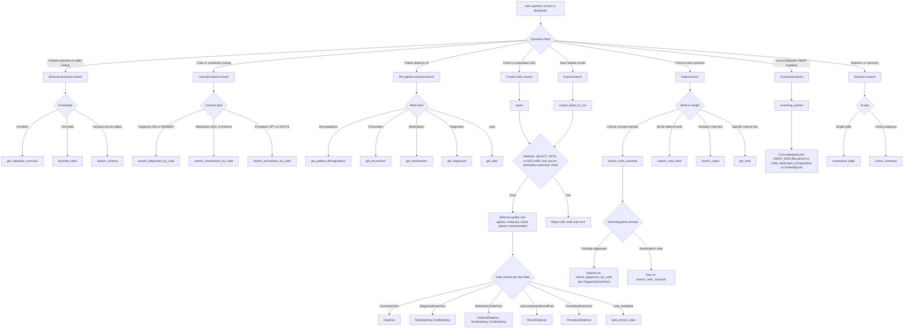
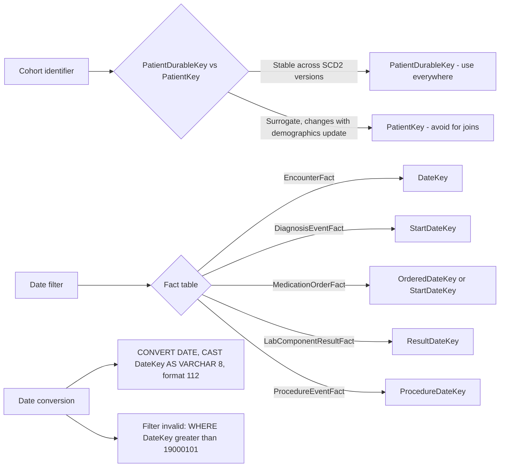
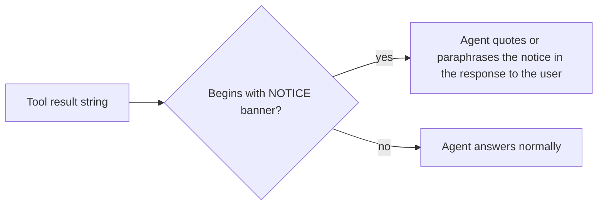

# Top-Level Routing Decision Tree

The CDWAgent does not perform classification or planning of its own; it relies on the Large Language Model that hosts BioRouter to read the server instructions delivered at session initialization and to dispatch tool calls accordingly. The diagram below replicates the decision tree encoded in `CDW_SERVER_INSTRUCTIONS` (defined in `src/cdwagent/server.py`). All node labels are taken verbatim from that constant or from the per-tool docstrings.

## Decision tree

## Glossary of nodes

| Node | Meaning | Source |
|---|---|---|
| Schema-qualify rule | Every table reference must carry the `deid_uf.` prefix; unqualified references resolve to the `deid` schema and lack `PatientDurableKey`. | `CDW_SERVER_INSTRUCTIONS`, `query` docstring, `export_query_to_csv` docstring |
| Subquery cohort pattern | `WHERE PatientDurableKey IN (SELECT DISTINCT PatientDurableKey FROM <fact> WHERE ...)` instead of joining `PatientDim` to a fact table. | `CDW_SERVER_INSTRUCTIONS` performance section |
| Validator | `ClinicalQueryValidator.is_read_only_clinical_query` accepts only statements starting with `SELECT`, `WITH`, or `DECLARE`, blocks write keywords, and rejects multi-statement chains. | `src/cdwagent/validation.py` |
| Date column per fact table | The agent must select the date key appropriate to each fact table; guessing a generic `DateKey` causes incorrect filtering on `DiagnosisEventFact`, `MedicationOrderFact`, `LabComponentResultFact`, and `ProcedureEventFact`. | `CDW_SERVER_INSTRUCTIONS` |
| Disambiguation prompt | When the user asks for "diabetic patients" without specifying coding versus mention, the agent surfaces the sensitivity-specificity trade-off and either asks or runs both branches. | `CDW_SERVER_INSTRUCTIONS` notes section, `search_note_concepts` docstring |
| Cross-database join | Crossmap is a cross-database query inside one SQL Server instance, not a cross-schema join. It reads `OMOP_DEID.dbo.person` and `CDW_NEW.deid_uf.PatientDim`. | `crossmap_patient` implementation |

## Identifier and date rules that bind every branch

The following rules apply uniformly across the structured-query branches `Q1`, `P1`, and `T1`, and across the cohort form of every notes tool.

## Routing signal

BioRouter does not classify questions before dispatch. The Large Language Model receives the union of all enabled extensions' tool descriptions plus the server instructions string, and selects a tool by name. Tool names therefore carry the `CDW-` namespace prefix to disambiguate from siblings such as UCSFOMOPAgent's `query_ucsf_omop`. The flow above is the implicit decision graph the model is expected to follow once it has read `CDW_SERVER_INSTRUCTIONS`.

## Methodological-transparency post-condition

A subset of tools (notably `search_note_concepts` and `search_note_sdoh` in their population-mode plan) prepend a `[NOTICE: ...]` banner to the result string when they apply an internal optimisation, default filter, or approximation that materially affects the interpretation of the returned data. The server instructions formalize a non-negotiable post-condition for the agent: when a tool result begins with `[NOTICE: ...]`, the agent quotes or paraphrases that notice in the user-facing reply. Suppressing notices is treated as a clinical-research integrity violation, since researchers must be able to assess whether the result fits their study's evidentiary requirements (e.g., strict recency for audit versus approximate recency for phenotype discovery).

