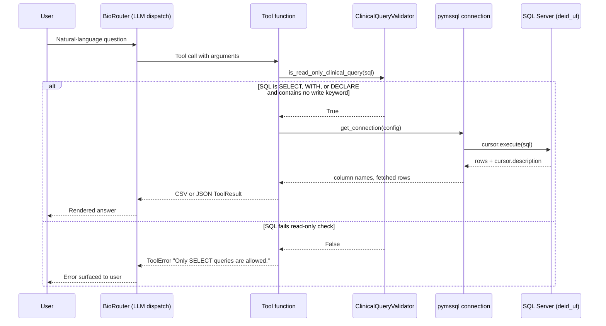

# Per-Tool Flow Index

The CDWAgent server registers twenty Model Context Protocol tools across six modules. Each tool is described in detail in the linked file, including a request-response sequence, an input-to-output flow, the exact tables touched, and known pitfalls drawn from the source docstring. Tool names appear without the runtime `CDW-` namespace prefix in the table below; at runtime each name is prepended with `CDW-` (or whatever value `CDW_NAMESPACE` resolves to).

## Tool catalog

| Tool name | Module | File | One-line purpose |
|---|---|---|---|
| `get_database_overview` | `tools/schema.py` | [schema-discovery.md](./schema-discovery.md) | Returns the catalog of all tables with descriptions and patient-key flags. |
| `describe_table` | `tools/schema.py` | [schema-discovery.md](./schema-discovery.md) | Returns column-level metadata and data-quality notes for one table. |
| `search_schema` | `tools/schema.py` | [schema-discovery.md](./schema-discovery.md) | Searches table and column names and descriptions for a keyword. |
| `query` | `tools/queries.py` | [clinical-queries.md](./clinical-queries.md) | Executes a validated read-only SQL SELECT and returns CSV rows. |
| `get_patient_demographics` | `tools/queries.py` | [clinical-queries.md](./clinical-queries.md) | Retrieves the most recent demographic record for one patient. |
| `get_encounters` | `tools/queries.py` | [clinical-queries.md](./clinical-queries.md) | Retrieves encounter history for one patient ordered by `DateKey`. |
| `get_medications` | `tools/queries.py` | [clinical-queries.md](./clinical-queries.md) | Retrieves medication orders for one patient ordered by `OrderedDateKey`. |
| `get_diagnoses` | `tools/queries.py` | [clinical-queries.md](./clinical-queries.md) | Retrieves diagnosis events for one patient ordered by `StartDateKey`. |
| `get_labs` | `tools/queries.py` | [clinical-queries.md](./clinical-queries.md) | Retrieves lab component results for one patient ordered by `ResultDateKey`. |
| `crossmap_patient` | `tools/queries.py` | [crossmap-bridge.md](./crossmap-bridge.md) | Resolves an OMOP `person_id` to a CDW `PatientDurableKey`. |
| `search_note_concepts` | `tools/notes.py` | [notes-retrieval.md](./notes-retrieval.md) | Searches NLP-extracted clinical concepts in notes (cTAKES). |
| `search_note_sdoh` | `tools/notes.py` | [notes-retrieval.md](./notes-retrieval.md) | Searches Social Determinants of Health concepts (cTAKES SDOH module). |
| `search_notes` | `tools/notes.py` | [notes-retrieval.md](./notes-retrieval.md) | Retrieves verbatim note text for a defined patient cohort. |
| `get_note` | `tools/notes.py` | [notes-retrieval.md](./notes-retrieval.md) | Returns the full text of one note by `deid_note_key`. |
| `search_diagnoses_by_code` | `tools/concepts.py` | [concept-search.md](./concept-search.md) | Resolves an ICD or SNOMED code or diagnosis name to `DiagnosisKey` values. |
| `search_medications_by_code` | `tools/concepts.py` | [concept-search.md](./concept-search.md) | Resolves an NDC or RxNorm code or drug name to `MedicationKey` values. |
| `search_procedures_by_code` | `tools/concepts.py` | [concept-search.md](./concept-search.md) | Resolves a CPT or HCPCS code or procedure name to procedure terminology rows. |
| `export_query_to_csv` | `tools/export.py` | [export.md](./export.md) | Streams a validated SELECT result to a CSV file at a specified path. |
| `summarize_table` | `tools/stats.py` | [statistics.md](./statistics.md) | Returns row counts and column null rates for one schema-qualified table. |
| `cohort_summary` | `tools/stats.py` | [statistics.md](./statistics.md) | Counts and stratifies a cohort defined by a `PatientDurableKey` subquery. |

## Common contract

Every tool runs through the same validator-and-connection lifecycle. The diagram below summarizes the shared path. Subsequent per-tool diagrams omit this preamble for clarity.

The schema-discovery tools (`get_database_overview`, `describe_table`, `search_schema`) bypass the validator and the database entirely; they read `src/cdwagent/data/schema_reference.json` from disk.
