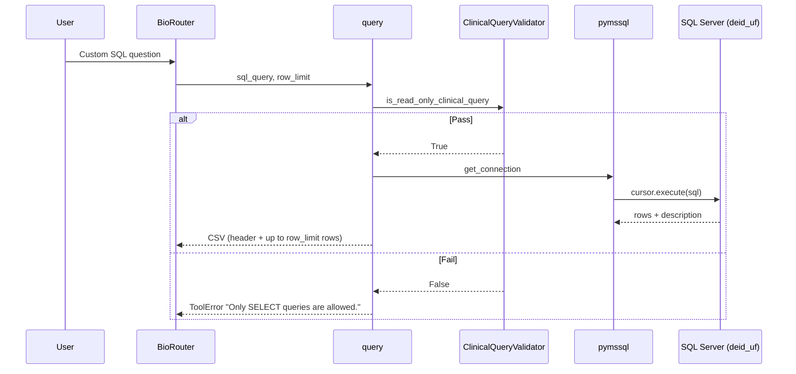
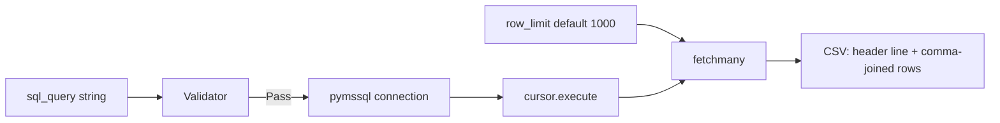
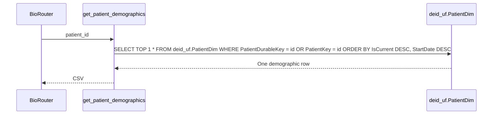
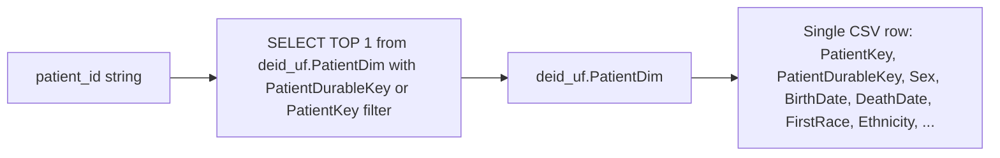
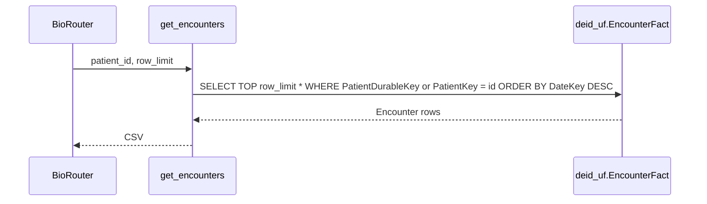
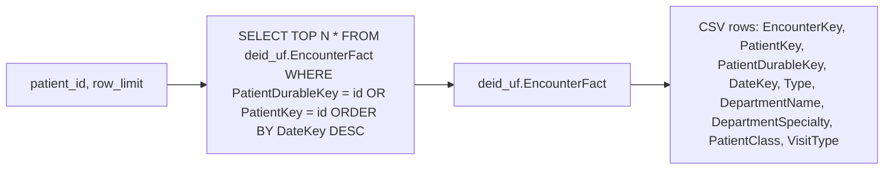
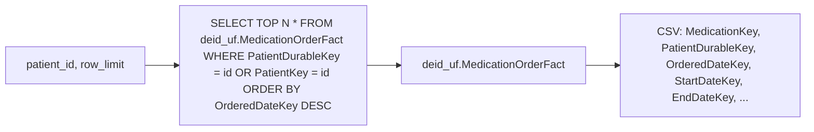
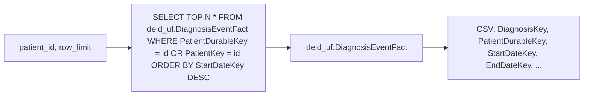
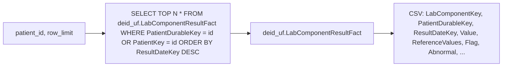

# Clinical Query Tools

Six tools live in `tools/queries.py` (a seventh, `crossmap_patient`, is documented separately under [crossmap-bridge.md](./crossmap-bridge.md)). One is a general-purpose SQL executor (`query`) and five are canned per-patient retrievals (`get_patient_demographics`, `get_encounters`, `get_medications`, `get_diagnoses`, `get_labs`). All six pass through `_execute_readonly_query`, which validates with `ClinicalQueryValidator.is_read_only_clinical_query`, opens a fresh `pymssql` connection, runs the query, fetches up to `row_limit` rows, and returns CSV.

## query

A clinical researcher invokes `query` when no canned tool matches the question. The docstring carries the schema-qualification rule as a banner because unqualified table references are the single largest error source observed in production.

Tables touched: any in `deid_uf`; the agent must include the schema prefix.

Defaults and limits: `row_limit=1000`. The validator rejects queries that do not start with `SELECT`, `WITH`, or `DECLARE`, that contain a write keyword (`MERGE|CREATE|SET|DELETE|REMOVE|ADD|INSERT|UPDATE|DROP|ALTER|TRUNCATE|GRANT|REVOKE|EXEC|EXECUTE|SP_`), or that chain a second statement after a semicolon.

Pitfalls: unqualified tables resolve to schema `deid` and miss `PatientDurableKey`; joining `PatientDim` to fact tables exceeds 120 seconds and times out; CTE-plus-JOIN also times out; correct pattern is `WHERE PatientDurableKey IN (SELECT DISTINCT PatientDurableKey FROM <fact> WHERE ...)`.

## get_patient_demographics

Used when the researcher already has a `PatientDurableKey` (or, less reliably, a `PatientKey`) and needs the most recent demographic record. The tool generated SQL accepts either identifier through an `OR` predicate and orders by `IsCurrent = 1` first then `StartDate DESC`, taking the top one row.

Tables touched: `deid_uf.PatientDim`.

Defaults and limits: returns one row.

Pitfalls: if the supplied identifier is a `PatientKey` from an outdated SCD2 version, the row returned may have `IsCurrent = 0`; the docstring directs the agent to prefer `PatientDurableKey` whenever available.

## get_encounters

Used when the researcher needs encounter-level history for a single patient. Orders by `DateKey DESC`, which is the correct date column for `EncounterFact`.

Tables touched: `deid_uf.EncounterFact`.

Pitfalls: the column is `Type`, not `EncounterType`. Date column is `DateKey`, not `EncounterDateKey`.

## get_medications

Used when the researcher needs prescription history. Orders by `OrderedDateKey DESC`. The docstring reminds the agent that for treatment-duration analysis the `StartDateKey` to `EndDateKey` span is the correct interval, not the order date.

Tables touched: `deid_uf.MedicationOrderFact`.

## get_diagnoses

Used when the researcher needs diagnosis events for a patient. Orders by `StartDateKey DESC`.

Tables touched: `deid_uf.DiagnosisEventFact`.

## get_labs

Used when the researcher needs lab component results for a patient. Orders by `ResultDateKey DESC`.

Tables touched: `deid_uf.LabComponentResultFact`.

Pitfalls: `NumericValue` is de-identified and contains the literal token `DEID`; the agent must use the `Value` string column for actual lab values. There is no `TextValue`, `ReferenceLow`, `ReferenceHigh`, or `AbnormalFlag` column; use `Value`, `ReferenceValues` (combined string), `Flag`, and `Abnormal`.
