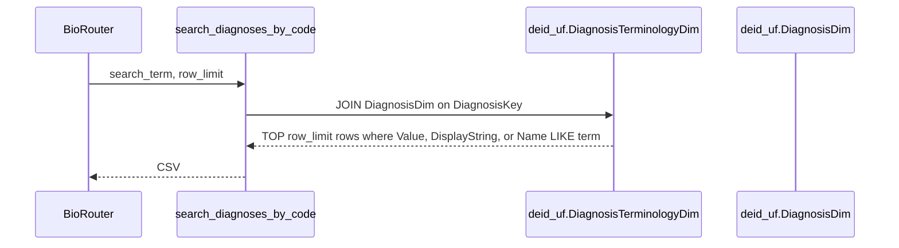
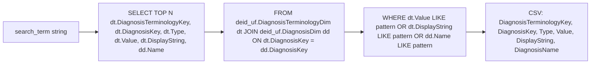
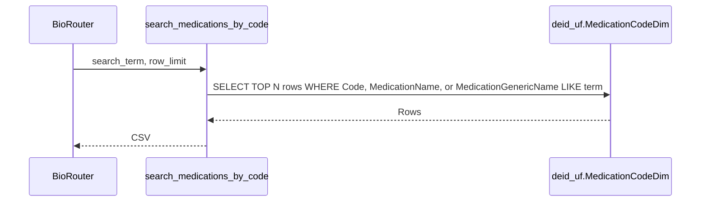
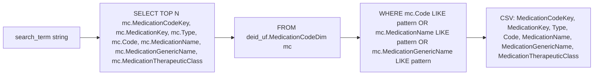
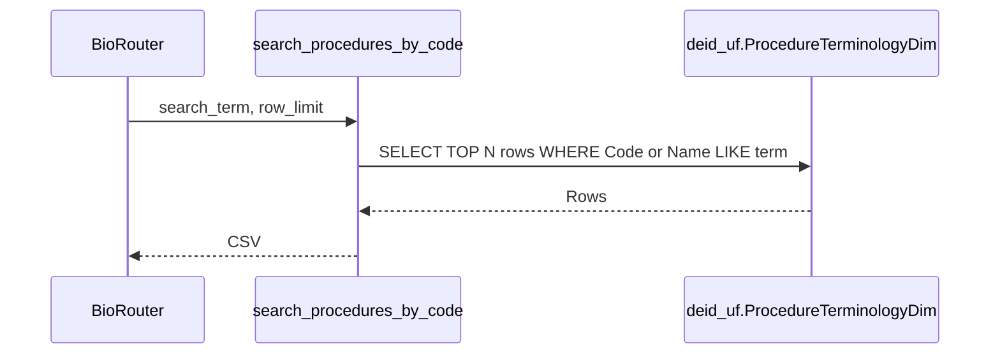
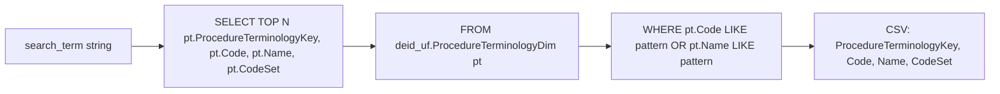

# Concept Search Tools

Three tools live in `tools/concepts.py`: `search_diagnoses_by_code`, `search_medications_by_code`, and `search_procedures_by_code`. They translate codes or names into the surrogate keys that fact tables reference. They are the canonical first step in any structured cohort workflow.

## search_diagnoses_by_code

Used when the researcher has an ICD or SNOMED code (or a textual diagnosis name) and needs the corresponding `DiagnosisKey` values that index `DiagnosisEventFact`. Joins the terminology table to the diagnosis dimension.

Tables touched: `deid_uf.DiagnosisTerminologyDim`, `deid_uf.DiagnosisDim`. Joining column: `DiagnosisKey`.

Defaults and limits: `row_limit=50`.

Pitfalls: substring `LIKE` matching can return many irrelevant rows when the search term is a short token (for example searching for "MI" matches every code containing the letters "MI"). The agent should narrow with a more specific code prefix when possible.

## search_medications_by_code

Used when the researcher has an NDC, RxNorm, brand name, or generic name and needs `MedicationKey` values that index `MedicationOrderFact`. Reads `MedicationCodeDim` only; `MedicationDim` lookup is implicit through the `MedicationKey` foreign key.

Tables touched: `deid_uf.MedicationCodeDim`.

Defaults and limits: `row_limit=50`.

Pitfalls: pre-Epic legacy `MedicationDim` records have `*Unspecified` values for `GenericName`, `TherapeuticClass`, `Strength`, and `Form`; only `Name` is reliable for those rows. The describe-table data note for `MedicationDim` records this caveat.

## search_procedures_by_code

Used when the researcher has a CPT or HCPCS code, or a textual procedure name, and needs procedure terminology rows that link to `ProcedureEventFact`.

Tables touched: `deid_uf.ProcedureTerminologyDim`.

Defaults and limits: `row_limit=50`.

Pitfalls: `CodeSet` distinguishes CPT, HCPCS, and other vocabularies; the agent should filter on `CodeSet` when the user has specified a vocabulary.
