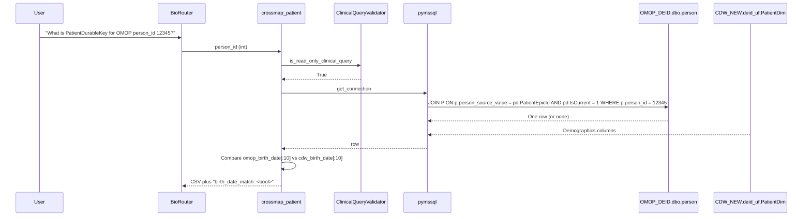
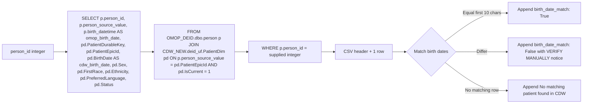

# Crossmap Bridge Tool

`crossmap_patient` resolves an OMOP `person_id` (from the `OMOP_DEID` database) to a CDW `PatientDurableKey` (in the `CDW_NEW.deid_uf.PatientDim` table). It is the bridge that lets a BioRouter session combining UCSFOMOPAgent and CDWAgent flow patient identifiers from one extension to the other.

## Rationale

A clinical researcher running an OMOP cohort selection in the OMOP agent obtains a list of `person_id` values. To pull the corresponding clinical detail (notes, full medication orders, lab strings) the analyst needs `PatientDurableKey` values understood by every downstream CDW tool. `crossmap_patient` performs that translation through a single cross-database join on a stable hospital-issued identifier (`PatientEpicId` in CDW, `person_source_value` in OMOP) and reports a sanity-check boolean by comparing birth dates.

## Sequence

## Flow

## Tables touched

| Database | Schema | Table | Joining column |
|---|---|---|---|
| `OMOP_DEID` | `dbo` | `person` | `person_source_value` |
| `CDW_NEW` | `deid_uf` | `PatientDim` | `PatientEpicId` |

The join requires that the SQL Server account have read access to both databases on the same instance. SQL Server permits cross-database joins when these conditions hold.

## Defaults and limits

The tool fetches a single row (`row_limit=1`). The integer cast `int(person_id)` rejects non-numeric input before the SQL is composed.

## Pitfalls

If the birth dates differ, the result is annotated with `(OMOP: ..., CDW: ... — VERIFY MANUALLY)`. A mismatch typically indicates an identifier collision, a data-load skew between the two databases, or a stale OMOP build. The tool does not fail in this case; it surfaces the discrepancy and lets the user decide.
