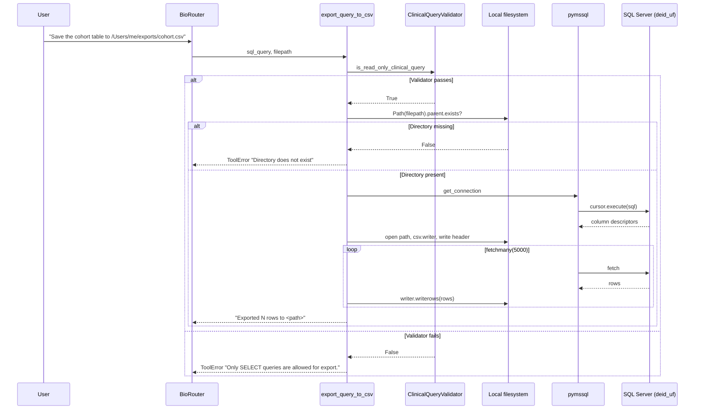
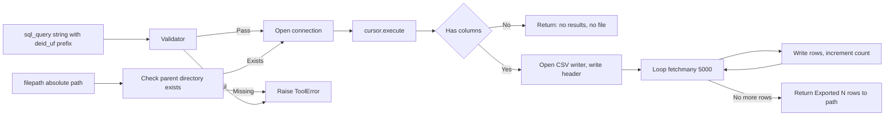

# Export Tool

`export_query_to_csv` executes a validated read-only SQL query and streams the result to a CSV file at a path supplied by the caller. It is the only CDWAgent tool that writes to the local filesystem, and the only tool whose return value is a side-effect summary rather than result rows.

## Rationale

The standard `query` tool returns at most `row_limit` (1000) rows in a CSV string embedded in the MCP response. For larger extracts the result must be streamed to disk. `export_query_to_csv` opens the output file, writes the column header, and pulls rows in batches of five thousand via `cursor.fetchmany(5000)` until the cursor is exhausted.

## Sequence

## Flow

## Tables touched

Any tables referenced in `sql_query`. The agent must schema-qualify with `deid_uf.`; the docstring carries that rule as a banner because unqualified names land in the `deid` schema and miss `PatientDurableKey`.

## Defaults and limits

There is no default `row_limit`; the export reads to cursor exhaustion. Batch size is hard-coded at 5000. Output directory must already exist; the tool does not create directories.

## Pitfalls

The path supplied by the user is treated literally. There is no sandbox or path-traversal check beyond `Path(filepath).parent.exists()`. The MCP server runs with the privileges of the BioRouter process, which means a misconfigured caller could overwrite files the user owns.
