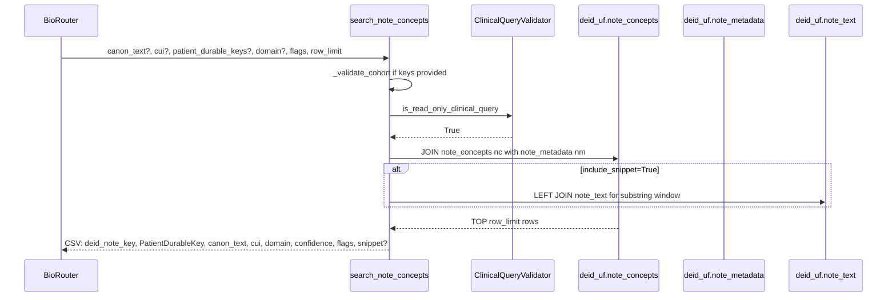
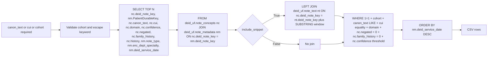
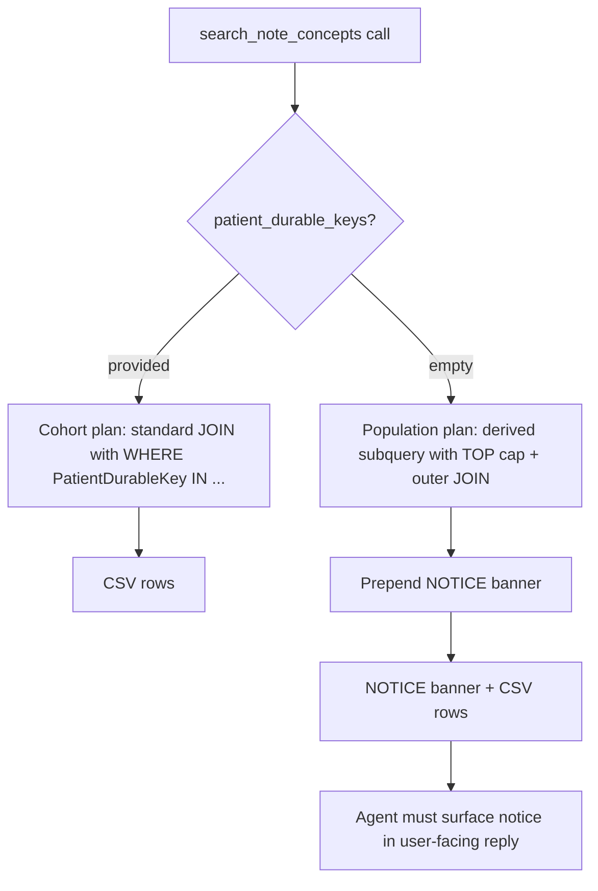
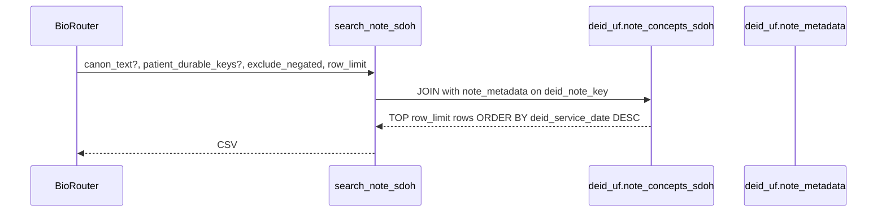
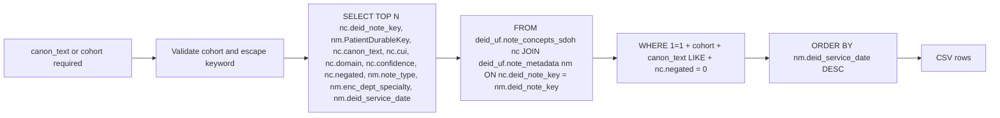
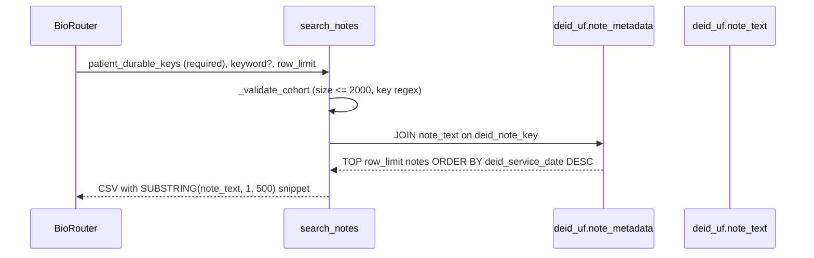
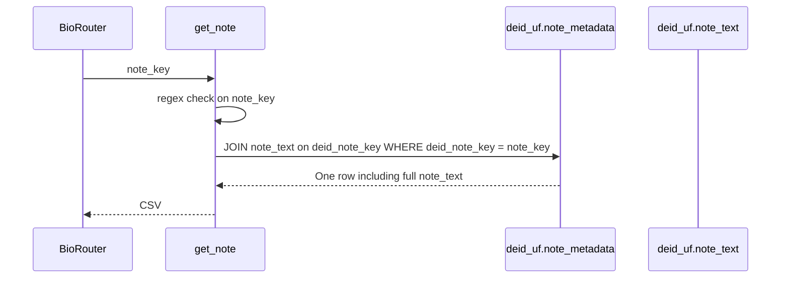

# Clinical Notes Tools

Four tools live in `tools/notes.py`: `search_note_concepts`, `search_note_sdoh`, `search_notes`, and `get_note`. The first three accept a cohort (a list of one or more `PatientDurableKey` values, validated against the regular expression `^[A-Za-z0-9_-]+$` and capped at 2000 entries). All four share the helper `_query_to_csv`, which validates SQL and returns CSV.

## search_note_concepts

Used when the question concerns clinical concepts mentioned in notes (diseases, drugs, symptoms, procedures). Backed by the cTAKES NLP layer indexed in `note_concepts`. Defaults `exclude_negated=True` and `exclude_family_history=True`, removing the most common false positives in retrospective phenotyping. `exclude_historical` defaults to `False` because historical mentions are typically clinically relevant for retrospective research.





Tables touched: `deid_uf.note_concepts` (joined to `deid_uf.note_metadata` on `deid_note_key`), optionally `deid_uf.note_text` for the snippet window.

Defaults and limits: `exclude_negated=True`, `exclude_family_history=True`, `exclude_historical=False`, `min_confidence=0.5`, `include_snippet=True`, `row_limit=100`. Cohort cap is 2000.

Pitfalls: this tool searches concepts mentioned, which is not the same as formally coded diagnoses. The disambiguation block in the docstring instructs the agent to surface this distinction when the user's question is ambiguous.

Population-mode optimisation (v0.4.3+): when invoked without `patient_durable_keys`, the tool emits two distinct SQL plans and prepends a `[NOTICE: ...]` banner to the result. The cohort plan applies the `PatientDurableKey IN (...)` filter directly and orders by date, since the cohort is selective enough to keep the join fast. The population plan rewrites the query as a derived subquery that pushes the `canon_text LIKE` and `negated`/`family_history`/`confidence` filters into an inner `SELECT TOP {row_limit*4}` and then joins `note_metadata` outside; the inner cap allows SQL Server to short-circuit the table scan once enough matches accumulate. The trade-off is that the returned rows are no longer the strict top-`row_limit` by `deid_service_date` but the top-`row_limit` of the first ~`row_limit*4` matches encountered. The notice banner instructs the agent to surface this approximation in its reply, per the methodological-transparency clause in the server instructions.



## search_note_sdoh

Used when the question concerns Social Determinants of Health (smoking status, housing instability, food insecurity, employment, substance use, transportation barriers). Backed by `note_concepts_sdoh`, populated by the cTAKES SDOH module. Structured fields rarely capture these signals, so the notes layer is often the only source.





Tables touched: `deid_uf.note_concepts_sdoh`, `deid_uf.note_metadata`.

Defaults and limits: `exclude_negated=True`, `row_limit=100`. Cohort cap is 2000.

Pitfalls: at least one of `canon_text` or `patient_durable_keys` must be supplied; otherwise the tool raises `ToolError`.

The same population-mode optimisation and `[NOTICE: ...]` banner described for `search_note_concepts` apply here when `patient_durable_keys` is omitted (v0.4.3+).

## search_notes

Used for chart review or verbatim phrase match. Requires a defined cohort. The optional `keyword` argument adds a `LIKE` filter on `note_text`. Returns up to fifty notes with a five-hundred-character snippet by default.



```mermaid
flowchart LR
    A[patient_durable_keys list required] --> V[_validate_cohort: regex, size cap, dedupe]
    V --> SQL[SELECT TOP N nm.deid_note_key, nm.PatientDurableKey, nm.note_type, nm.encounter_type, nm.enc_dept_specialty, nm.deid_service_date, SUBSTRING(nt.note_text, 1, 500) AS note_snippet]
    SQL --> J[FROM deid_uf.note_metadata nm JOIN deid_uf.note_text nt ON nm.deid_note_key = nt.deid_note_key]
    J --> W[WHERE nm.PatientDurableKey IN cohort + optional nt.note_text LIKE keyword]
    W --> O[ORDER BY nm.deid_service_date DESC]
    O --> R[CSV rows]
```

Tables touched: `deid_uf.note_metadata`, `deid_uf.note_text`.

Defaults and limits: `row_limit=50`. Cohort cap is 2000 patients (SQL Server `IN`-clause practical limit).

Pitfalls: free-text matches are noisy because they include differential diagnoses, assessments, and history; for clinical-concept search the docstring directs the agent to prefer `search_note_concepts`. For cohorts above 2000 patients, only `search_note_concepts` scales.

## get_note

Used when the agent already has a `deid_note_key` (typically from `search_notes` or `search_note_concepts`) and needs the full note body.



```mermaid
flowchart LR
    A[note_key string] --> V{Regex check ^[A-Za-z0-9_-]+$}
    V -->|Pass| SQL[SELECT nm.deid_note_key, nm.note_type, nm.encounter_type, nm.enc_dept_specialty, nm.deid_service_date, nt.note_text]
    V -->|Fail| E[ToolError invalid note_key format]
    SQL --> J[FROM deid_uf.note_metadata nm JOIN deid_uf.note_text nt ON nm.deid_note_key = nt.deid_note_key]
    J --> W[WHERE nm.deid_note_key = note_key]
    W --> R[CSV with full text]
```

Tables touched: `deid_uf.note_metadata`, `deid_uf.note_text`.

Pitfalls: the note text can be very long. Callers that handle long contexts should consume the returned CSV stream rather than parsing in-memory.
