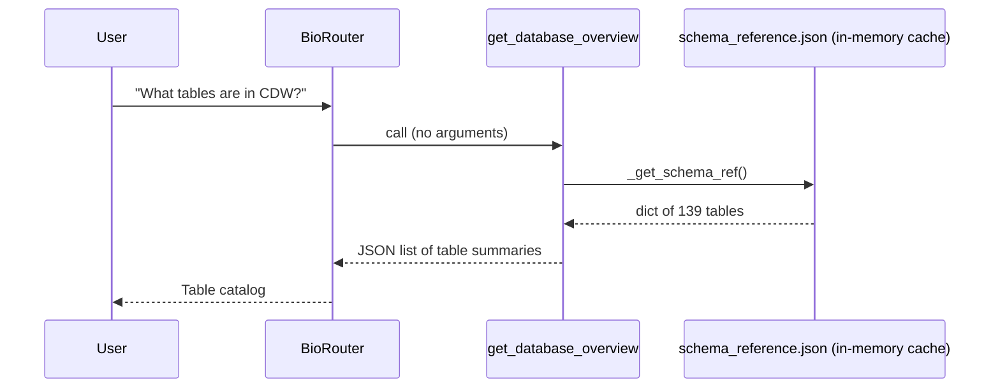
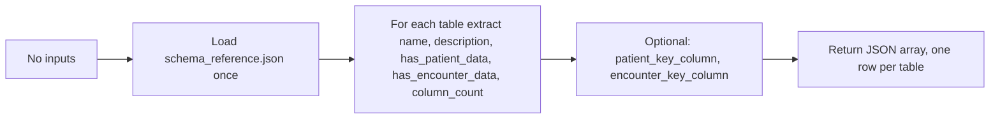
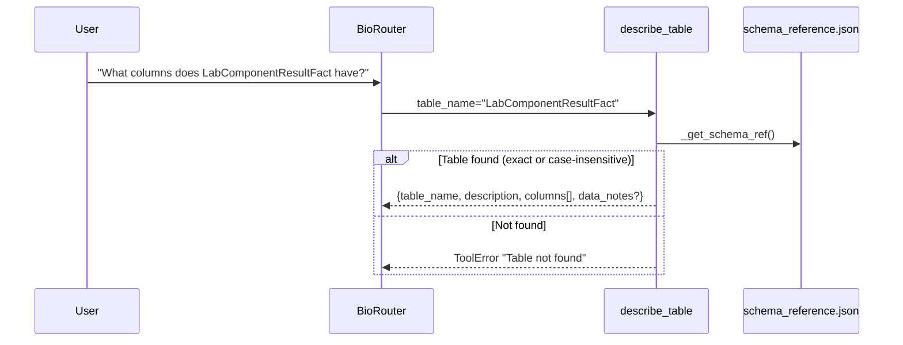
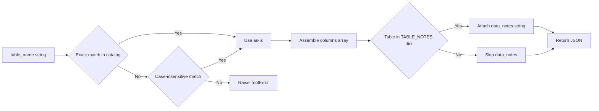
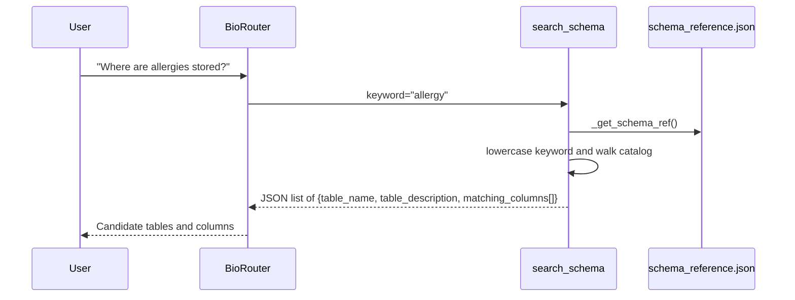
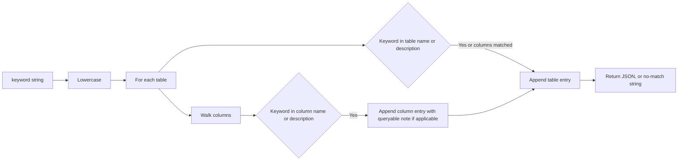

# Schema Discovery Tools

Three tools support schema discovery: `get_database_overview`, `describe_table`, and `search_schema`. None of the three opens a database connection; all read the bundled file `src/cdwagent/data/schema_reference.json`, which is cached in module-level state on first read by `_get_schema_ref`.

## get_database_overview

A clinical researcher invokes this tool when starting an exploration with no prior knowledge of which tables exist. It returns one entry per table containing the table name, description, two boolean flags indicating whether the table holds patient-level or encounter-level data, the column count, and the patient and encounter key columns when present.

Tables touched: none. The output is computed entirely from the bundled JSON catalog.

Defaults and limits: returns all 139 tables. No pagination.

Pitfall: the description fields are not exhaustive. For unfamiliar tables the agent should follow up with `describe_table`.

## describe_table

Used when the agent needs the exact column list of a table before composing SQL. Performs a case-insensitive lookup if the supplied name is not an exact match. Includes data-quality notes for four tables that have known caveats: `PatientDim` (SCD Type 2), `LabComponentResultFact` (de-identified `NumericValue`), `LabComponentDim` (`LoincCode` not `Loinc`), and `MedicationDim` (pre-Epic legacy fields).

Tables touched: none.

Defaults and limits: returns the full column list for one table.

Pitfall: columns marked `queryable=false` in the JSON catalog do not exist in the SQL view; the docstring instructs the agent to use the corresponding base column instead, for example `DateKey` rather than `DateKeyValue`.

## search_schema

Used when the researcher knows a clinical concept (such as "allergy" or "vital sign") but does not know which table or column houses it. Runs a substring match (case-insensitive) over both table names and descriptions, and over column names and descriptions, then returns matching tables with their matching columns.

Tables touched: none.

Defaults and limits: pure substring match. No semantic expansion or synonym handling.

Pitfall: the keyword "diabetes" returns tables that mention "diabetes" anywhere in metadata, but does not return `DiagnosisDim` rows for diabetes; for that, the agent should call `search_diagnoses_by_code`.
