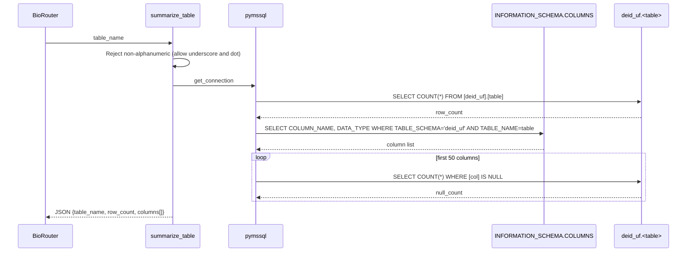
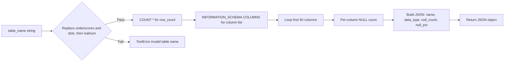
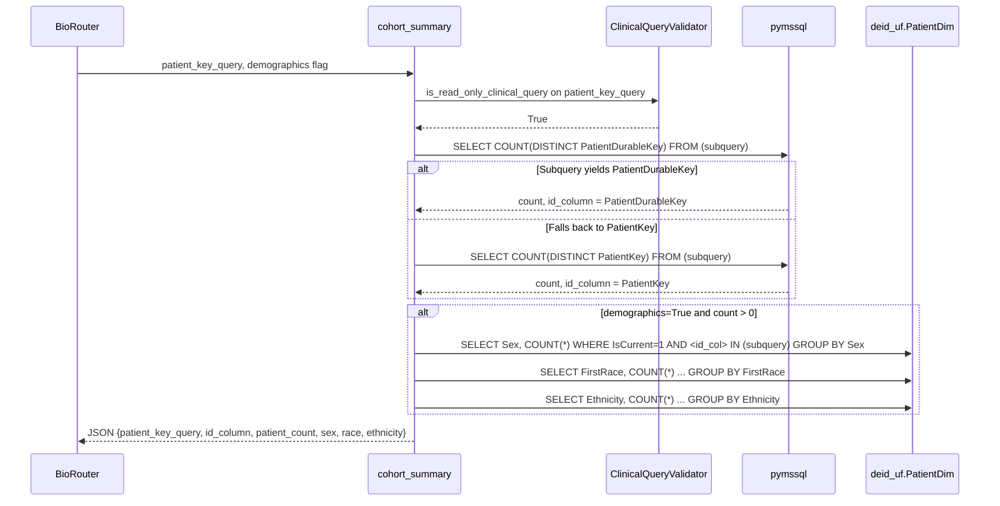
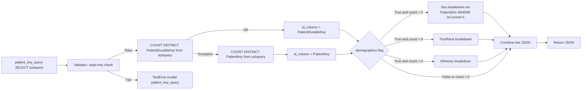

# Statistics Tools

Two tools live in `tools/stats.py`: `summarize_table` for table-level profiling and `cohort_summary` for cohort-level demographics aggregation.

## summarize_table

Used when the researcher needs to understand the shape and density of a table before composing a query. Returns the row count and, for the first fifty columns, the data type, null count, and null percentage.

Tables touched: `[deid_uf].[<table>]` plus `INFORMATION_SCHEMA.COLUMNS`.

Defaults and limits: profiles the first fifty columns by ordinal position. Uses bracket-quoted identifiers `[deid_uf].[table]` so `summarize_table` works on any user-supplied table name that passes the alphanumeric check.

Pitfalls: per-column null-count probes scale linearly with column count; tables with many columns or large row counts may approach the BioRouter timeout. The fifty-column cap mitigates this.

## cohort_summary

Used to count and stratify a cohort defined by an arbitrary subquery returning patient identifiers. The tool auto-detects whether the subquery yields `PatientDurableKey` (preferred) or `PatientKey` (fallback), then computes counts and demographic breakdowns by joining `PatientDim` filtered to `IsCurrent = 1`.

Tables touched: any tables in the user-supplied `patient_key_query`, plus `deid_uf.PatientDim` for the three demographic GROUP BY queries.

Defaults and limits: `demographics=True`. The auto-detection mechanism uses a try-except on the `PatientDurableKey` count query and falls back to `PatientKey` only on exception.

Pitfalls: using `PatientKey` rather than `PatientDurableKey` in the subquery silently triggers the fallback path, but the demographic stratification then joins on `PatientKey` against `PatientDim WHERE IsCurrent = 1`, which matches only the subset of historical surrogate keys that happen to coincide with the current SCD2 row (approximately sixteen percent in observed data). The docstring directs the agent to use `PatientDurableKey` in every subquery.
