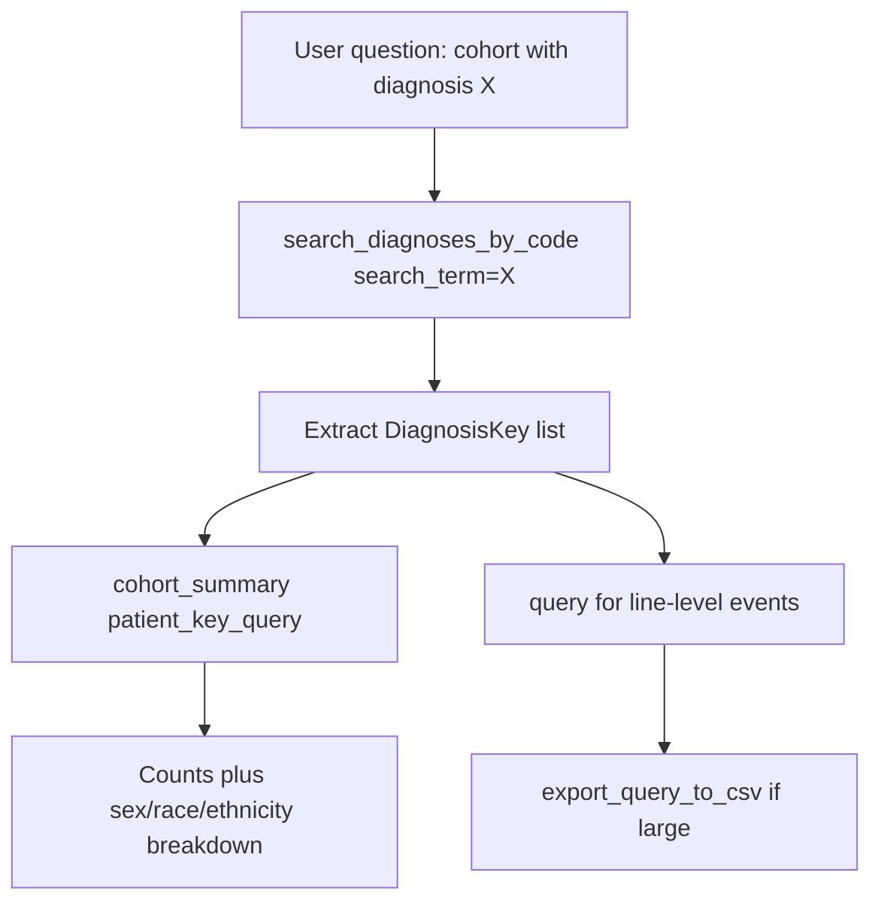

# Cohort Identification by Structured Codes

Research question: "Identify all patients with a coded diagnosis of multiple sclerosis (ICD-10 G35) in the data warehouse."

Structured-code cohort identification is the highest-specificity option. It depends on a clinician (or coder) having entered the diagnosis on the patient's problem list or as a billing code on an encounter, and therefore corresponds to formally documented disease.

## Tool composition



## Canonical SQL pattern

```sql
-- Step 1: resolve the code to DiagnosisKey values via search_diagnoses_by_code
-- (returned rows include dt.DiagnosisKey and dd.Name)

-- Step 2: define cohort using the subquery pattern
SELECT DISTINCT PatientDurableKey
FROM deid_uf.DiagnosisEventFact
WHERE DiagnosisKey IN (
    SELECT DiagnosisKey
    FROM deid_uf.DiagnosisTerminologyDim
    WHERE Type = 'ICD-10-CM' AND Value LIKE 'G35%'
)
  AND StartDateKey > 19000101;

-- Step 3: hand the subquery to cohort_summary, or pull demographics directly
SELECT PatientDurableKey, Sex, BirthDate, FirstRace, Ethnicity
FROM deid_uf.PatientDim
WHERE IsCurrent = 1
  AND PatientDurableKey IN (
    SELECT DISTINCT PatientDurableKey
    FROM deid_uf.DiagnosisEventFact
    WHERE DiagnosisKey IN (
      SELECT DiagnosisKey
      FROM deid_uf.DiagnosisTerminologyDim
      WHERE Type = 'ICD-10-CM' AND Value LIKE 'G35%'
    )
);
```

## Trade-offs

| Dimension | Behavior |
|---|---|
| Sensitivity | Lower than NLP-mention. Misses patients seen for symptoms but never formally coded. |
| Specificity | High. Coded diagnoses imply clinical and administrative review. |
| Performance | Subquery pattern executes in well under one second on observed cohort sizes. |
| Reproducibility | Strong. Codes are stable terminology artifacts. |

## Common mistakes

- Joining `deid_uf.PatientDim` directly to `deid_uf.DiagnosisEventFact` instead of using `WHERE PatientDurableKey IN (subquery)`. This reliably exceeds 120 seconds and times out.
- Using `PatientKey` rather than `PatientDurableKey`, missing patients whose demographics were updated after the diagnosis event.
- Omitting the `deid_uf.` prefix; unqualified table names resolve to schema `deid` and lack `PatientDurableKey`.
- Filtering by `DateKey` rather than `StartDateKey` on `DiagnosisEventFact`; `DiagnosisEventFact` does not have a `DateKey` column.
