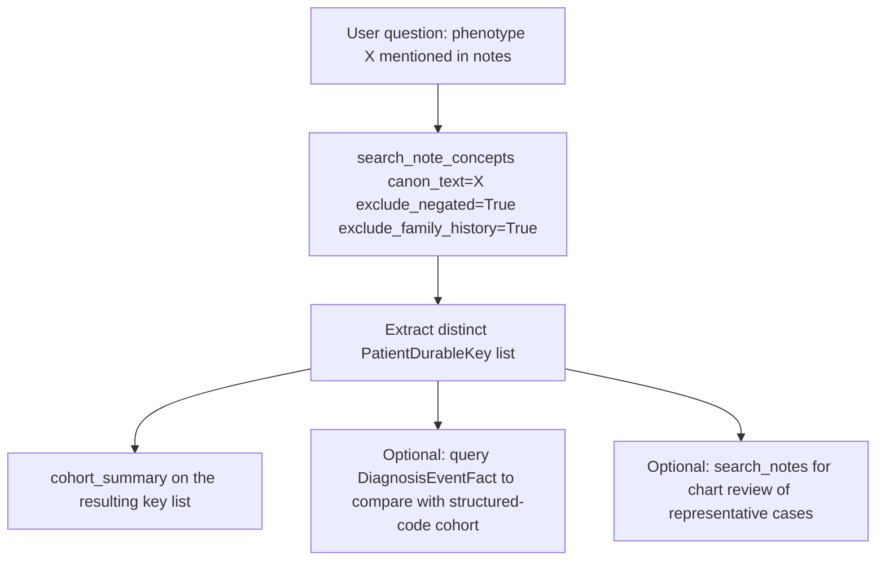

# Phenotype Identification by NLP-Mentioned Concepts

Research question: "Identify patients with any clinical mention of pulmonary embolism in their notes, regardless of whether they were formally coded."

This workflow targets the cTAKES-extracted concept layer in `deid_uf.note_concepts`. It is the high-sensitivity counterpart to the structured-code workflow: it captures patients whose chart suggests a phenotype even when no ICD code was filed.

## Tool composition



## Canonical SQL pattern

The agent does not write the SQL directly; it issues a `search_note_concepts` call with `canon_text='pulmonary embolism'` and no cohort. Internally that produces the following query (taken verbatim from `tools/notes.py`):

```sql
SELECT TOP 100 nc.deid_note_key, nm.PatientDurableKey,
       nc.canon_text, nc.cui, nc.domain, nc.confidence,
       nc.negated, nc.family_history, nc.history,
       nm.note_type, nm.enc_dept_specialty, nm.deid_service_date,
       SUBSTRING(nt.note_text,
         CASE WHEN nc.offset_start - 100 < 1 THEN 1 ELSE nc.offset_start - 100 END,
         200) AS snippet
FROM deid_uf.note_concepts nc
JOIN deid_uf.note_metadata nm ON nc.deid_note_key = nm.deid_note_key
LEFT JOIN deid_uf.note_text nt ON nc.deid_note_key = nt.deid_note_key
WHERE 1=1
  AND nc.canon_text LIKE '%pulmonary embolism%'
  AND nc.negated = 0
  AND nc.family_history = 0
  AND nc.confidence >= 0.5
ORDER BY nm.deid_service_date DESC;
```

To convert that into a cohort the agent extracts the distinct `PatientDurableKey` values from the result and feeds them either to `cohort_summary` or to a downstream `query` that joins to fact tables.

## Trade-offs

| Dimension | Behavior |
|---|---|
| Sensitivity | High. Captures mentions in assessments, differentials, and history. |
| Specificity | Lower than coded. Without negation/family-history filters the precision drops sharply. The defaults `exclude_negated=True` and `exclude_family_history=True` mitigate this. |
| Performance | Fast at population scale because `note_concepts` is pre-extracted; the `LIKE` on `canon_text` is the main cost. |
| Coverage | Limited to the time range and note types ingested by the cTAKES pipeline. |

## Common mistakes

- Disabling `exclude_negated` or `exclude_family_history` without a study-design reason; this re-introduces "no history of X" and "father had X" matches.
- Treating mentions as diagnoses; the docstring explicitly warns the agent to surface this disambiguation to the user.
- Running `search_notes` (verbatim) for clinical concepts when `search_note_concepts` would be both faster and more accurate.
- Forgetting that `min_confidence=0.5` is the default; lowering it widens recall but adds noise.
- Suppressing the `[NOTICE: ...]` banner the tool emits in population mode (no cohort). The notice signals an early-termination optimisation that returns the first ~`row_limit*4` matches rather than the strict top-`row_limit` by recency. The agent is required to surface this approximation in its reply; researchers needing strict recency must restrict the search to a cohort.
