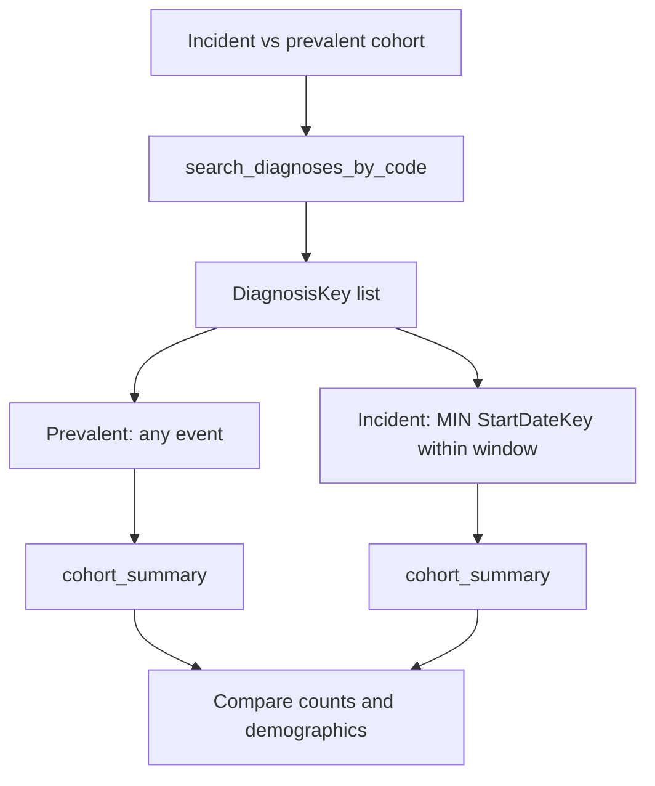

# Time-Restricted Cohort

Research question: "Identify patients with an incident multiple sclerosis diagnosis between 2019 and 2023 (first-ever recorded MS event in that window) and contrast with the prevalent population (any MS event ever)."

Time restrictions distinguish prevalence (any event) from incidence (first event). They also support new-user designs in pharmacoepidemiology, where the index date is the first prescription of the drug of interest.

## Tool composition



## Canonical SQL pattern

Prevalent cohort:

```sql
SELECT DISTINCT PatientDurableKey
FROM deid_uf.DiagnosisEventFact
WHERE DiagnosisKey IN (/* keys from search_diagnoses_by_code */)
  AND StartDateKey BETWEEN 20190101 AND 20231231;
```

Incident cohort (first-ever event falls in the window):

```sql
SELECT PatientDurableKey
FROM (
    SELECT PatientDurableKey, MIN(StartDateKey) AS FirstStart
    FROM deid_uf.DiagnosisEventFact
    WHERE DiagnosisKey IN (/* keys from search_diagnoses_by_code */)
      AND StartDateKey > 19000101
    GROUP BY PatientDurableKey
) sub
WHERE FirstStart BETWEEN 20190101 AND 20231231;
```

New-user (first-ever exposure to a drug within the window):

```sql
SELECT PatientDurableKey
FROM (
    SELECT PatientDurableKey, MIN(StartDateKey) AS FirstStart
    FROM deid_uf.MedicationOrderFact
    WHERE MedicationKey IN (/* keys from search_medications_by_code */)
      AND StartDateKey > 19000101
    GROUP BY PatientDurableKey
) sub
WHERE FirstStart BETWEEN 20190101 AND 20231231;
```

## Trade-offs

| Dimension | Behavior |
|---|---|
| Incidence | Sensitive to data-availability bias. A patient who joined the EHR after their true first diagnosis appears as incident under naive logic. |
| Prevalence | Insensitive to time bias but conflates new and old cases. |
| New-user design | Strong for causal pharmacoepidemiology; requires a wash-out period not implemented in the SQL above. |

## Common mistakes

- Using `EndDateKey` rather than `StartDateKey` on `DiagnosisEventFact` to define the index date. `StartDateKey` is the documented index column.
- Forgetting the date-validity filter `StartDateKey > 19000101`, which lets sentinel zero-keys leak into incident cohorts.
- Defining incidence as "first event in the window" without ensuring no prior event exists. The `MIN()` aggregate above implements that correctly only when the data goes back far enough.
- Filtering by `OrderedDateKey` for new-user designs when the question concerns when treatment began; `StartDateKey` is the correct column for treatment-start.
