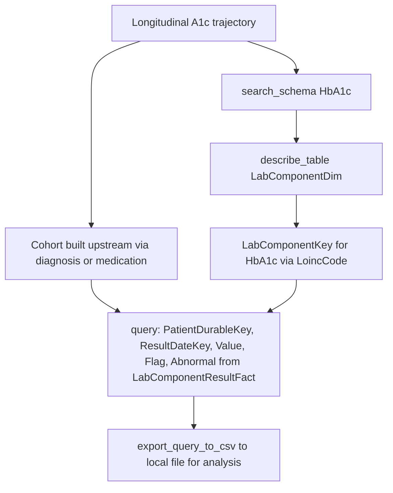

# Lab and Biomarker Trajectory Analysis

Research question: "Plot HbA1c values over time for the diabetic cohort and identify those whose A1c trajectory worsened by more than one percentage point in the past year."

Trajectory analysis longitudinal-orders lab values for a defined cohort, ordered by `ResultDateKey`. The lab dimension lookup uses `LoincCode` (note the spelling, per the docstring) to identify the analyte.

## Tool composition



## Canonical SQL pattern

```sql
SELECT
    r.PatientDurableKey,
    r.ResultDateKey,
    CONVERT(DATE, CAST(r.ResultDateKey AS VARCHAR(8)), 112) AS ResultDate,
    r.Value,
    TRY_CAST(r.Value AS FLOAT) AS NumericA1c,
    r.ReferenceValues,
    r.Flag,
    r.Abnormal
FROM deid_uf.LabComponentResultFact r
WHERE r.LabComponentKey IN (
        SELECT LabComponentKey
        FROM deid_uf.LabComponentDim
        WHERE LoincCode IN ('4548-4', '17856-6')
    )
  AND r.PatientDurableKey IN (
        SELECT DISTINCT PatientDurableKey
        FROM deid_uf.DiagnosisEventFact
        WHERE DiagnosisKey IN (/* T2D keys from search_diagnoses_by_code */)
          AND StartDateKey > 19000101
    )
  AND r.ResultDateKey > 19000101
ORDER BY r.PatientDurableKey, r.ResultDateKey;
```

## Trade-offs

| Dimension | Behavior |
|---|---|
| Granularity | Per-result row; aggregation (rolling mean, slope) happens client-side after export. |
| Numeric parsing | `TRY_CAST(Value AS FLOAT)` handles the string-typed `Value` column; some entries (qualitative results, ranges) cast to `NULL`. |
| Performance | Subquery cohort pattern keeps the join in `LabComponentResultFact` linear in the cohort size. |

## Common mistakes

- Using `r.NumericValue`. That column is de-identified and contains the literal string `DEID`. Use `r.Value` plus `TRY_CAST` instead.
- Using `LabComponentDim.Loinc` (does not exist) instead of `LoincCode`. The describe-table data note for `LabComponentDim` records this.
- Sorting by `OrderedDateKey` (does not exist on `LabComponentResultFact`); the correct column is `ResultDateKey`.
- Joining `PatientDim` to `LabComponentResultFact` directly to filter by demographics; that pattern times out. Apply demographic filters at the cohort-construction stage instead.
