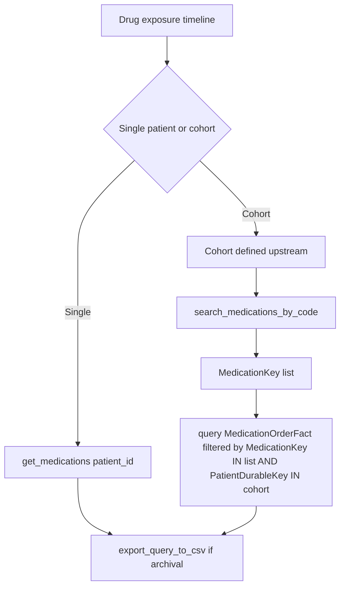

# Drug Exposure Trajectory

Research question: "Reconstruct the medication exposure timeline (orders and durations) for a single patient on disease-modifying therapy, then aggregate the same view across a cohort."

Drug exposure trajectories require both `OrderedDateKey` (when the order was written) and the `StartDateKey`/`EndDateKey` span (when the drug was actively in use). The single-patient view uses `get_medications`; the cohort view uses `query` against `MedicationOrderFact`.

## Tool composition



## Canonical SQL pattern

Single-patient (issued by `get_medications`):

```sql
SELECT TOP 1000 *
FROM deid_uf.MedicationOrderFact
WHERE PatientDurableKey = 'P12345' OR PatientKey = 'P12345'
ORDER BY OrderedDateKey DESC;
```

Cohort timeline:

```sql
SELECT
    PatientDurableKey,
    MedicationKey,
    OrderedDateKey,
    StartDateKey,
    EndDateKey,
    CONVERT(DATE, CAST(StartDateKey AS VARCHAR(8)), 112) AS StartDate,
    CONVERT(DATE, CAST(EndDateKey AS VARCHAR(8)), 112) AS EndDate
FROM deid_uf.MedicationOrderFact
WHERE MedicationKey IN (/* keys from search_medications_by_code */)
  AND PatientDurableKey IN (/* cohort subquery */)
  AND StartDateKey > 19000101
ORDER BY PatientDurableKey, StartDateKey;
```

## Trade-offs

| Dimension | Behavior |
|---|---|
| Order vs exposure | An order is not the same as an exposure. `StartDateKey`/`EndDateKey` is the documented exposure span. |
| Coverage | Pre-Epic legacy rows have `*Unspecified` for `GenericName`, `TherapeuticClass`, `Strength`, and `Form`. Only `Name` is reliable for those rows. |
| Trajectory shape | Rendering exposure as bars per patient requires client-side reshaping after export. |

## Common mistakes

- Using only `OrderedDateKey` for exposure analysis. The docstring on `get_medications` and `CDW_SERVER_INSTRUCTIONS` both call out that `StartDateKey`/`EndDateKey` is the correct span.
- Searching by drug name in `MedicationDim` rather than via `search_medications_by_code` against `MedicationCodeDim`; the latter handles brand-name and generic-name aliases plus NDC and RxNorm codes.
- Forgetting the date-validity filter `StartDateKey > 19000101`, which causes sentinel zero-keys to skew interval visualizations.
