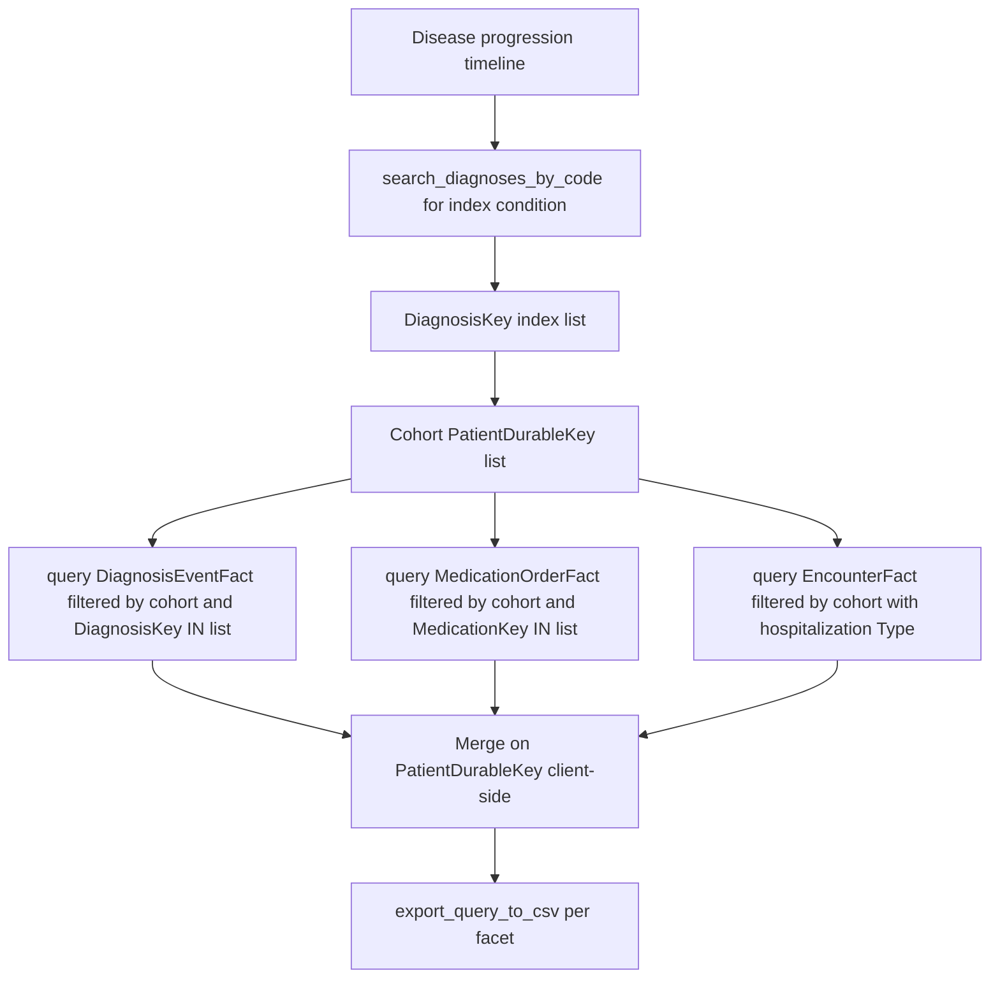

# Disease Progression Sequence

Research question: "Reconstruct the order of clinical events for patients with progressive multiple sclerosis: first MS diagnosis, first disease-modifying-therapy prescription, first relapse, transition to secondary progressive."

Progression analyses require ordered sequences of events across `DiagnosisEventFact`, `MedicationOrderFact`, and possibly `EncounterFact`. The agent stitches these together by `PatientDurableKey` and the appropriate per-fact-table date column.

## Tool composition



## Canonical SQL pattern

```sql
-- First diagnosis date per patient
SELECT PatientDurableKey, MIN(StartDateKey) AS FirstDiagnosisKey
FROM deid_uf.DiagnosisEventFact
WHERE DiagnosisKey IN (/* index condition keys */)
  AND PatientDurableKey IN (/* cohort */)
  AND StartDateKey > 19000101
GROUP BY PatientDurableKey;

-- First DMT prescription per patient
SELECT PatientDurableKey, MIN(StartDateKey) AS FirstDMTStartKey
FROM deid_uf.MedicationOrderFact
WHERE MedicationKey IN (/* DMT keys */)
  AND PatientDurableKey IN (/* cohort */)
  AND StartDateKey > 19000101
GROUP BY PatientDurableKey;

-- First inpatient stay relevant to the disease
SELECT PatientDurableKey, MIN(DateKey) AS FirstInpatientKey
FROM deid_uf.EncounterFact
WHERE Type = 'Hospital Encounter'
  AND PatientDurableKey IN (/* cohort */)
  AND DateKey > 19000101
GROUP BY PatientDurableKey;
```

The agent merges these three result sets on `PatientDurableKey` after retrieval. Each query alone respects the subquery cohort pattern.

## Trade-offs

| Dimension | Behavior |
|---|---|
| Event resolution | Day-level via the `*DateKey` integers. Sub-day timing is not modeled. |
| Cross-fact joins | Forbidden by the performance guidance for cohort definition; aggregation per fact table and merging client-side avoids the timeout. |
| Ascertainment | Progression markers (relapse, secondary progression) often live in notes; supplement with `search_note_concepts` if needed. |

## Common mistakes

- Asking the database to perform the cross-fact merge with a single multi-fact `JOIN`. The `CDW_SERVER_INSTRUCTIONS` performance section warns this times out. Aggregate per fact table, then merge.
- Using the same `*DateKey` column across all fact tables. Each fact table has its own column: `DateKey` for `EncounterFact`, `StartDateKey` for `DiagnosisEventFact`, `StartDateKey` (treatment start) for `MedicationOrderFact`.
- Defining `Type = 'Inpatient'` on `EncounterFact`. The column value is `Hospital Encounter`; verify with `describe_table('EncounterFact')` and `summarize_table('EncounterFact')` first.
