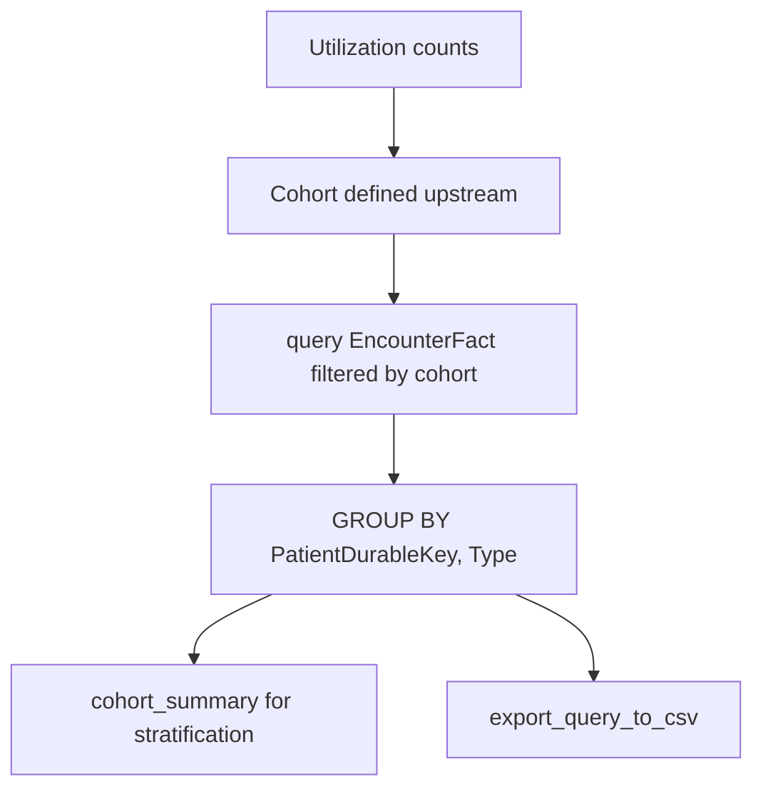

# Healthcare Utilization

Research question: "Quantify outpatient visits, emergency department visits, and inpatient admissions per patient for the heart-failure cohort over the past two years."

Healthcare utilization analyses count encounters by `Type` and `DepartmentSpecialty`, ordered by `DateKey`. They are stratified by patient and time window.

## Tool composition



## Canonical SQL pattern

```sql
SELECT
    PatientDurableKey,
    Type,
    COUNT(*) AS EncounterCount,
    MIN(DateKey) AS FirstEncounterKey,
    MAX(DateKey) AS LastEncounterKey
FROM deid_uf.EncounterFact
WHERE PatientDurableKey IN (/* cohort */)
  AND DateKey BETWEEN 20230101 AND 20241231
GROUP BY PatientDurableKey, Type;

-- Emergency-department subset
SELECT PatientDurableKey, COUNT(*) AS EDVisits
FROM deid_uf.EncounterFact
WHERE PatientDurableKey IN (/* cohort */)
  AND DepartmentSpecialty LIKE '%Emergency%'
  AND DateKey BETWEEN 20230101 AND 20241231
GROUP BY PatientDurableKey;
```

## Trade-offs

| Dimension | Behavior |
|---|---|
| Type fidelity | `Type` distinguishes outpatient, inpatient, and emergency at a coarse level; specialty-level filtering uses `DepartmentSpecialty` or `DepartmentName`. |
| Window selection | `DateKey` is the documented date column for `EncounterFact`. |
| Skew | High-utilization patients dominate raw counts; rate-based metrics (per-patient-month) require an explicit denominator. |

## Common mistakes

- Filtering on `EncounterType`. The column is `Type`; the docstring on `get_encounters` and the server instructions both call this out.
- Using `StartDateKey` on `EncounterFact`. The date column is `DateKey`.
- Joining `PatientDim` to `EncounterFact` to filter by demographics; the subquery cohort pattern with demographic constraints applied to `PatientDim` separately is required.
- Treating `Type = 'Emergency'` as the ED filter; `Type` may carry other values, so combining with `DepartmentSpecialty LIKE '%Emergency%'` is more reliable.
