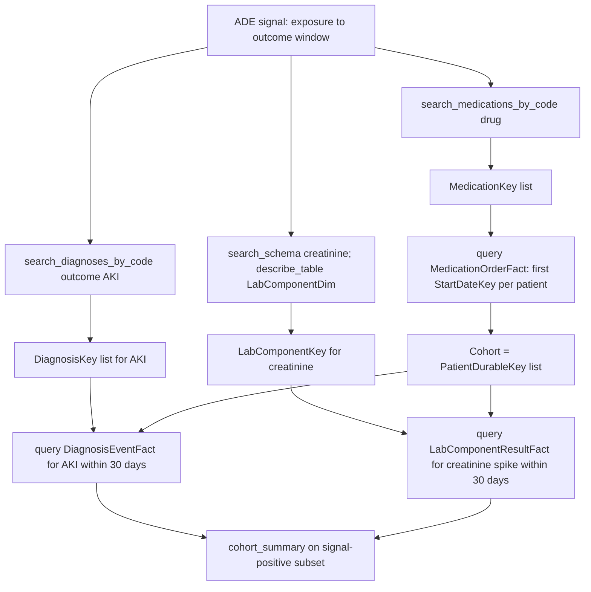

# Adverse Drug Event Signal Detection

Research question: "Detect a possible signal of acute kidney injury (AKI) following exposure to a new drug — find patients with a first prescription of the drug and an AKI diagnosis or rising creatinine within 30 days."

Adverse drug event (ADE) signal detection compares an exposure interval against an outcome interval for each patient. The CDW representation is two fact-table queries joined on `PatientDurableKey` plus a date-difference predicate.

## Tool composition



## Canonical SQL pattern

```sql
-- 1. Define the exposed cohort (first ever order of the drug)
WITH FirstExposure AS (
    SELECT PatientDurableKey, MIN(StartDateKey) AS ExpStartKey
    FROM deid_uf.MedicationOrderFact
    WHERE MedicationKey IN (/* drug keys from search_medications_by_code */)
      AND StartDateKey > 19000101
    GROUP BY PatientDurableKey
)
SELECT * FROM FirstExposure;
-- Materialize the cohort and ExpStartKey client-side rather than joining a CTE
-- across fact tables (CTE+JOIN times out, per CDW_SERVER_INSTRUCTIONS).

-- 2. AKI outcome within 30 days of ExpStartKey
SELECT d.PatientDurableKey, d.StartDateKey AS AKIDateKey
FROM deid_uf.DiagnosisEventFact d
WHERE d.DiagnosisKey IN (/* AKI keys */)
  AND d.PatientDurableKey IN (/* exposed cohort, hard-coded */)
  AND d.StartDateKey BETWEEN 20240101 AND 20241231
  AND d.StartDateKey > 19000101;
-- After retrieval, filter rows whose StartDateKey is within 30 days
-- after the patient's ExpStartKey from step 1.

-- 3. Optional: creatinine spike within 30 days
SELECT r.PatientDurableKey, r.ResultDateKey, r.Value, r.Flag, r.Abnormal
FROM deid_uf.LabComponentResultFact r
WHERE r.LabComponentKey IN (/* creatinine keys */)
  AND r.PatientDurableKey IN (/* exposed cohort */)
  AND r.ResultDateKey > 19000101;
```

## Trade-offs

| Dimension | Behavior |
|---|---|
| Confounding by indication | The same disease that motivates the prescription may itself raise outcome risk; ADE signals from observational data require careful adjustment. |
| Background rate | Signal detection without a comparator is descriptive; a self-controlled or active-comparator design is needed for inference. |
| Window choice | 30 days is a common default but the agent should let the user override it. |

## Common mistakes

- Using a single multi-fact subquery to identify exposed cohort plus outcome event simultaneously. The performance section in `CDW_SERVER_INSTRUCTIONS` directs the agent to use a 2-step approach with hard-coded `IN (...)` lists.
- Computing the date difference inside SQL across fact tables; this entangles the query plan and slows execution. Compute the per-patient `ExpStartKey` first, then push the window check into a client-side filter or a flat `BETWEEN` on integer keys.
- Treating an order date (`OrderedDateKey`) as the start of exposure. `StartDateKey` on `MedicationOrderFact` is the documented exposure-start column.
