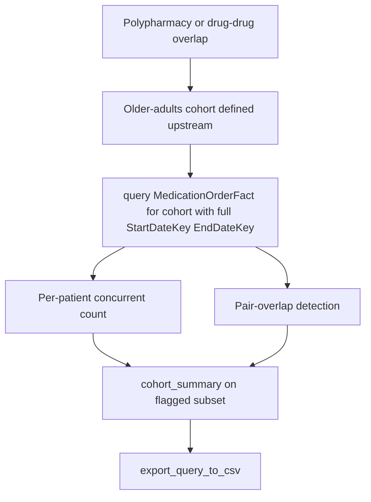

# Polypharmacy and Drug-Drug Overlap

Research question: "Among older adults, identify patients with five or more concurrent prescriptions on any single day, and flag specific high-risk combinations (such as opioid plus benzodiazepine)."

Polypharmacy analysis counts overlapping `[StartDateKey, EndDateKey]` intervals per patient. Drug-drug overlap detection looks for pairs of intervals on the same patient that share a temporal window.

## Tool composition



## Canonical SQL pattern

Concurrency at a fixed reference date:

```sql
SELECT PatientDurableKey, COUNT(DISTINCT MedicationKey) AS ConcurrentMeds
FROM deid_uf.MedicationOrderFact
WHERE PatientDurableKey IN (/* older-adults cohort */)
  AND StartDateKey <= 20240601
  AND EndDateKey   >= 20240601
  AND StartDateKey > 19000101
GROUP BY PatientDurableKey
HAVING COUNT(DISTINCT MedicationKey) >= 5;
```

Specific pair overlap (opioid plus benzodiazepine):

```sql
SELECT a.PatientDurableKey,
       a.MedicationKey AS Drug1Key, a.StartDateKey AS Drug1Start, a.EndDateKey AS Drug1End,
       b.MedicationKey AS Drug2Key, b.StartDateKey AS Drug2Start, b.EndDateKey AS Drug2End
FROM deid_uf.MedicationOrderFact a
JOIN deid_uf.MedicationOrderFact b
  ON a.PatientDurableKey = b.PatientDurableKey
 AND a.MedicationKey <> b.MedicationKey
 AND a.StartDateKey <= b.EndDateKey
 AND b.StartDateKey <= a.EndDateKey
WHERE a.MedicationKey IN (/* opioid keys */)
  AND b.MedicationKey IN (/* benzodiazepine keys */)
  AND a.PatientDurableKey IN (/* cohort */)
  AND a.StartDateKey > 19000101
  AND b.StartDateKey > 19000101;
```

## Trade-offs

| Dimension | Behavior |
|---|---|
| Self-join cost | The pair-overlap self-join over `MedicationOrderFact` can be expensive at scale; the cohort filter is essential. |
| Definition of concurrent | Day-level overlap is straightforward; dose-aware concurrency requires sig parsing not implemented in CDW. |
| Discontinuation | An order whose `EndDateKey` is sentinel may inflate concurrency; filter to plausible windows. |

## Common mistakes

- Using `OrderedDateKey` for overlap windows; the documented exposure span is `StartDateKey` to `EndDateKey`.
- Allowing a self-join without the cohort filter. The performance guidance in `CDW_SERVER_INSTRUCTIONS` warns against unrestricted joins.
- Counting orders rather than distinct medications. A single drug may have multiple overlapping orders; `COUNT(DISTINCT MedicationKey)` is what most users intend.
