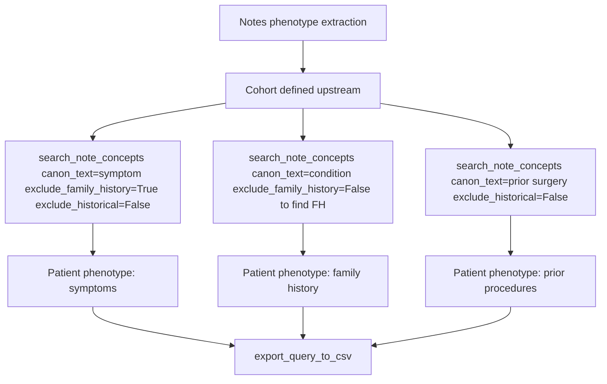

# Notes Phenotype Extraction

Research question: "For the inflammatory bowel disease cohort, extract from clinical notes any mention of family history of IBD, prior bowel surgery, and current symptoms (abdominal pain, blood in stool)."

Notes phenotype extraction layers `search_note_concepts` calls with different flag combinations to separate symptoms (current), family history (excluded by default but turned on for FH research), and historical mentions (turned on for prior conditions).

## Tool composition



## Canonical SQL pattern

The agent does not author SQL directly; it issues three `search_note_concepts` calls. Generated SQL for the family-history call (note that `nc.family_history = 0` is omitted because the user wants those mentions):

```sql
SELECT TOP 100 nc.deid_note_key, nm.PatientDurableKey,
       nc.canon_text, nc.cui, nc.domain, nc.confidence,
       nc.negated, nc.family_history, nc.history,
       nm.note_type, nm.enc_dept_specialty, nm.deid_service_date,
       SUBSTRING(nt.note_text,
         CASE WHEN nc.offset_start - 100 < 1 THEN 1 ELSE nc.offset_start - 100 END,
         200) AS snippet
FROM deid_uf.note_concepts nc
JOIN deid_uf.note_metadata nm ON nc.deid_note_key = nm.deid_note_key
LEFT JOIN deid_uf.note_text nt ON nc.deid_note_key = nt.deid_note_key
WHERE 1=1
  AND nm.PatientDurableKey IN ('P1', 'P2', 'P3')
  AND nc.canon_text LIKE '%inflammatory bowel disease%'
  AND nc.negated = 0
  AND nc.confidence >= 0.5
ORDER BY nm.deid_service_date DESC;
```

## Trade-offs

| Dimension | Behavior |
|---|---|
| Flag interpretation | `negated`, `family_history`, and `history` are NLP-derived booleans. They reduce noise but are not perfect. |
| Domain filter | Setting `domain='Disease'` or `'Symptom'` further narrows results when the canonical text is generic. |
| Snippet length | The default 200-character snippet (100 before, 100 after) supports manual review without retrieving full notes. |

## Common mistakes

- Forgetting that `exclude_family_history` defaults to `True`. To find family-history mentions the agent must set it to `False`.
- Using `search_notes` for clinical concepts. The notes-tools docstring explicitly directs the agent to prefer `search_note_concepts`.
- Submitting a cohort larger than 2000 patients. The `_validate_cohort` helper rejects with a `ToolError` and recommends `search_note_concepts` without a cohort for population-wide phenotype discovery.
- Treating any single mention as a confirmed phenotype; representative-snippet review is part of the workflow.
