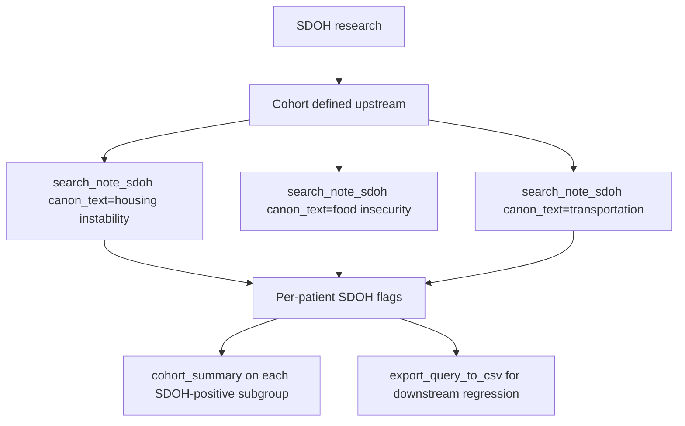

# Social Determinants of Health Research

Research question: "Among the heart-failure cohort, identify patients with documented housing instability, food insecurity, or transportation barriers in their notes, and quantify how these factors associate with readmission."

Structured fields rarely capture SDOH. The cTAKES SDOH module populates `deid_uf.note_concepts_sdoh`, which `search_note_sdoh` queries. SDOH research therefore depends almost entirely on the notes layer.

## Tool composition



## Canonical SQL pattern

Issued by `search_note_sdoh(canon_text='housing instability', patient_durable_keys=cohort)`:

```sql
SELECT TOP 100 nc.deid_note_key, nm.PatientDurableKey,
       nc.canon_text, nc.cui, nc.domain, nc.confidence, nc.negated,
       nm.note_type, nm.enc_dept_specialty, nm.deid_service_date
FROM deid_uf.note_concepts_sdoh nc
JOIN deid_uf.note_metadata nm ON nc.deid_note_key = nm.deid_note_key
WHERE 1=1
  AND nm.PatientDurableKey IN ('P1', 'P2', 'P3')
  AND nc.canon_text LIKE '%housing instability%'
  AND nc.negated = 0
ORDER BY nm.deid_service_date DESC;
```

## Trade-offs

| Dimension | Behavior |
|---|---|
| Coverage | Notes-derived signal is the only available source for most SDOH constructs. |
| Confidence | NLP extraction is imperfect; representative-snippet review remains essential. |
| Recall | Population-wide search (no cohort) is feasible because `note_concepts_sdoh` is pre-extracted. |

## Common mistakes

- Calling `search_note_concepts` (general clinical concepts) for SDOH terms. The SDOH-specific table is `note_concepts_sdoh`; `search_note_sdoh` is the correct entry point.
- Setting `exclude_negated=False` without a study reason. Negated mentions ("denies homelessness") would be miscounted as positive.
- Combining cohort and `canon_text` filters with a cohort larger than 2000 keys; `_validate_cohort` rejects oversize cohorts.
- Omitting the `[NOTICE: ...]` banner from the user-facing reply when `search_note_sdoh` was invoked in population mode. The banner indicates that the tool returned the first ~`row_limit*4` matches encountered rather than the strict most-recent set; equity research requiring a defensible recency window must constrain the search to a cohort.
