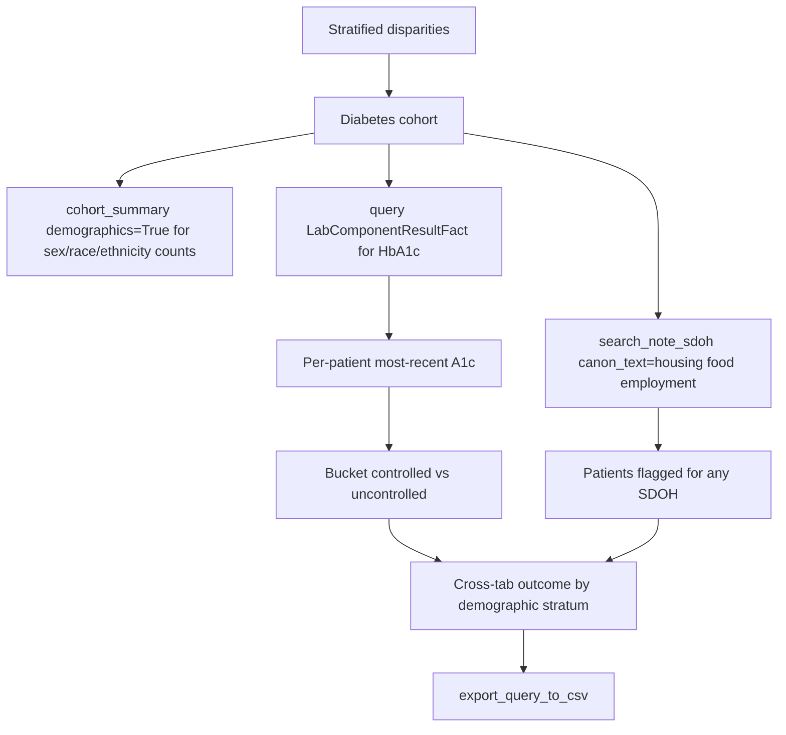

# Stratified Disparities Analysis

Research question: "For the diabetes cohort, compare HbA1c control rates across race, ethnicity, preferred-language, and SDOH-flagged subgroups."

Stratified analysis applies the same per-patient outcome to multiple demographic and social strata defined on `deid_uf.PatientDim` and on `deid_uf.note_concepts_sdoh`.

## Tool composition



## Canonical SQL pattern

Per-patient most-recent A1c plus demographic columns (avoiding the forbidden `PatientDim` join to `LabComponentResultFact`):

```sql
-- Step 1: per-patient most recent A1c
WITH MostRecentA1c AS (
    SELECT PatientDurableKey,
           MAX(ResultDateKey) AS LastResultKey
    FROM deid_uf.LabComponentResultFact
    WHERE LabComponentKey IN (/* HbA1c keys */)
      AND PatientDurableKey IN (/* diabetes cohort */)
      AND ResultDateKey > 19000101
    GROUP BY PatientDurableKey
)
SELECT * FROM MostRecentA1c;
-- Materialize, then in a separate query pull the actual Value:

SELECT r.PatientDurableKey, r.ResultDateKey, r.Value
FROM deid_uf.LabComponentResultFact r
WHERE r.PatientDurableKey IN (/* cohort */)
  AND r.ResultDateKey IN (/* hard-coded MAX result keys per patient */);

-- Step 2: demographics (separate query against PatientDim, no fact-table join)
SELECT PatientDurableKey, Sex, FirstRace, Ethnicity, PreferredLanguage
FROM deid_uf.PatientDim
WHERE IsCurrent = 1
  AND PatientDurableKey IN (/* cohort */);

-- Step 3: SDOH flags via search_note_sdoh on the cohort
```

The agent merges the three result sets on `PatientDurableKey` client-side.

## Trade-offs

| Dimension | Behavior |
|---|---|
| Cell sizes | Stratified counts may fall below privacy thresholds; the de-identified schema does not enforce small-cell suppression. |
| Causal interpretation | Disparities analyses describe association; causal inference requires additional design. |
| SDOH ascertainment | Notes-derived SDOH suffers from documentation bias correlated with care intensity. |

## Common mistakes

- Joining `deid_uf.PatientDim` to `deid_uf.LabComponentResultFact` to filter labs by race; this times out per the performance guidance. Apply demographic filters as a separate query against `PatientDim`, then intersect on `PatientDurableKey`.
- Using `PatientKey` rather than `PatientDurableKey` to merge the demographic and outcome sets across SCD2 versions.
- Treating absence of an SDOH flag as absence of the social condition; SDOH ascertainment is incomplete by construction.
