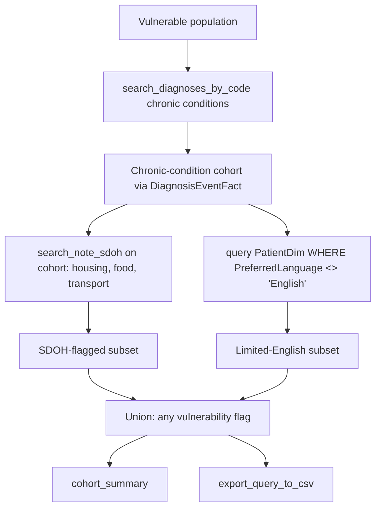

# Vulnerable Population Identification

Research question: "Identify patients who are likely vulnerable: those with at least one of housing instability, food insecurity, transportation barrier, or limited-English proficiency, who also have a chronic condition such as heart failure or COPD."

Vulnerable-population identification combines structured constraints (`deid_uf.PatientDim.PreferredLanguage`, chronic-disease diagnosis codes) with notes-derived SDOH signal from `search_note_sdoh`.

## Tool composition



## Canonical SQL pattern

```sql
-- Chronic-condition cohort
WITH ChronicCohort AS (
    SELECT DISTINCT PatientDurableKey
    FROM deid_uf.DiagnosisEventFact
    WHERE DiagnosisKey IN (/* heart failure or COPD keys */)
      AND StartDateKey > 19000101
)
SELECT * FROM ChronicCohort;

-- Limited-English subset (separate query against PatientDim)
SELECT PatientDurableKey, PreferredLanguage
FROM deid_uf.PatientDim
WHERE IsCurrent = 1
  AND PatientDurableKey IN (/* chronic-cohort keys */)
  AND (PreferredLanguage IS NULL OR PreferredLanguage <> 'English');
```

The SDOH branch is satisfied by `search_note_sdoh(canon_text='housing instability', patient_durable_keys=chronic_cohort)` and similar calls. The agent unions the resulting `PatientDurableKey` lists client-side.

## Trade-offs

| Dimension | Behavior |
|---|---|
| Composite definition | Vulnerability constructs are non-standard; document the inclusion criteria precisely. |
| Notes coverage | SDOH ascertainment is incomplete; absence of a flag does not prove absence of the social condition. |
| Multi-source merge | The agent must merge the structured-language subset with the notes-derived SDOH subset by `PatientDurableKey`. |

## Common mistakes

- Trying to express the SDOH constraint inside a single SQL statement that joins `note_concepts_sdoh` with `DiagnosisEventFact` and `PatientDim` simultaneously; the cross-fact subquery pattern times out.
- Filtering preferred language by exact match `<> 'English'` without considering null and variant strings ("English (United States)").
- Using `PatientKey` to merge the chronic-cohort fact-table output with `PatientDim`, missing patients whose demographics changed over time.
