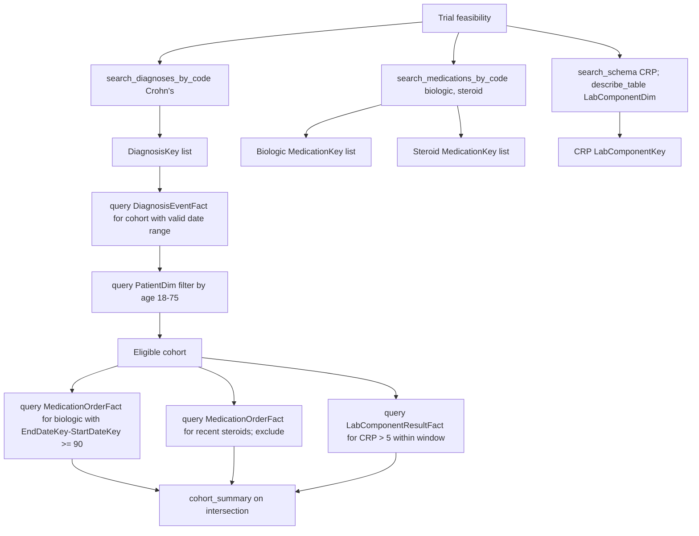

# Clinical Trial Feasibility

Research question: "Estimate the number of patients in the data warehouse who would meet the eligibility criteria of a phase 2 trial: adults 18 to 75 with biopsy-confirmed Crohn's disease, on stable biologic therapy for at least three months, no recent systemic steroids, and a baseline CRP above five."

Feasibility analyses simulate trial eligibility by intersecting demographic, diagnostic, medication, and lab constraints. The challenge is that the multi-criteria intersection guidance applies (workflow 3) and that several criteria require time anchoring.

## Tool composition



## Canonical SQL pattern

```sql
-- Adults 18-75 with Crohn's
SELECT PatientDurableKey
FROM deid_uf.PatientDim
WHERE IsCurrent = 1
  AND DATEDIFF(YEAR, BirthDate, GETDATE()) BETWEEN 18 AND 75
  AND PatientDurableKey IN (
        SELECT DISTINCT PatientDurableKey
        FROM deid_uf.DiagnosisEventFact
        WHERE DiagnosisKey IN (/* Crohn's keys */)
          AND StartDateKey > 19000101
  );

-- Stable biologic therapy at least 90 days
SELECT DISTINCT PatientDurableKey
FROM deid_uf.MedicationOrderFact
WHERE MedicationKey IN (/* biologic keys */)
  AND EndDateKey - StartDateKey >= 90
  AND StartDateKey > 19000101
  AND PatientDurableKey IN (/* eligible cohort */);

-- No systemic steroid order in past 30 days (NOT IN of recent orders)
-- Baseline CRP above 5
SELECT PatientDurableKey, ResultDateKey, Value
FROM deid_uf.LabComponentResultFact
WHERE LabComponentKey IN (/* CRP keys */)
  AND TRY_CAST(Value AS FLOAT) > 5
  AND ResultDateKey > 19000101
  AND PatientDurableKey IN (/* eligible cohort */);
```

## Trade-offs

| Dimension | Behavior |
|---|---|
| Documentation completeness | Many real-world trial criteria (functional status, biopsy verification) are not in structured fields. |
| Conservative estimate | A naive feasibility count overstates the eligible pool because notes evidence is missing. |
| Sensitivity to date windows | "Stable on therapy for 90 days" is highly window-dependent; the documented exposure span uses `StartDateKey` and `EndDateKey`. |

## Common mistakes

- Estimating the diagnosis cohort from `search_note_concepts` rather than `DiagnosisEventFact` for trial feasibility. Trial recruitment usually requires confirmed coded diagnoses.
- Using `OrderedDateKey` rather than `StartDateKey` for the exposure-stability check.
- Joining `PatientDim` to fact tables to apply the age filter; the subquery pattern with the age filter applied separately on `PatientDim` and intersected by `PatientDurableKey` is the correct approach.
