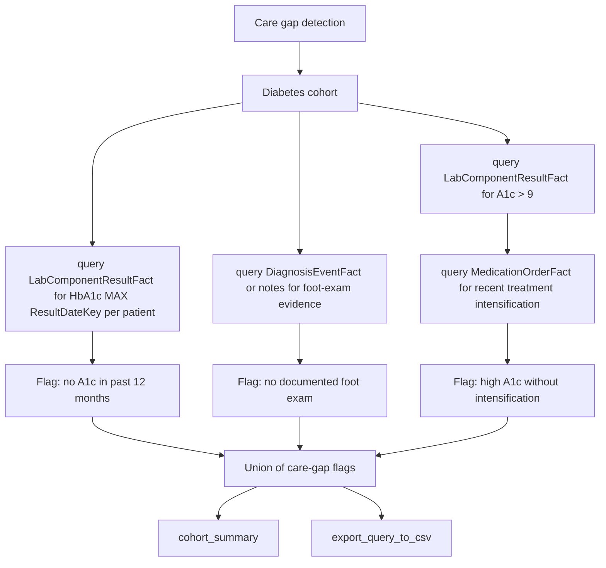

# Care Gap Detection

Research question: "Among the diabetes cohort, identify patients who have not had an HbA1c measurement in the past twelve months, who have not had a documented foot exam, or who have an HbA1c above nine percent without a recent treatment intensification."

Care-gap detection compares an expected event (lab, screening, exam, treatment change) against the recent timeline of each patient and flags absences.

## Tool composition



## Canonical SQL pattern

```sql
-- Patients with no A1c in past 12 months
SELECT PatientDurableKey
FROM deid_uf.PatientDim
WHERE IsCurrent = 1
  AND PatientDurableKey IN (/* diabetes cohort */)
  AND PatientDurableKey NOT IN (
        SELECT DISTINCT PatientDurableKey
        FROM deid_uf.LabComponentResultFact
        WHERE LabComponentKey IN (/* HbA1c keys */)
          AND ResultDateKey > 20230601
  );

-- Patients with HbA1c > 9 in last 6 months
SELECT DISTINCT r.PatientDurableKey, MAX(r.ResultDateKey) AS LastHighKey
FROM deid_uf.LabComponentResultFact r
WHERE r.LabComponentKey IN (/* HbA1c keys */)
  AND TRY_CAST(r.Value AS FLOAT) > 9
  AND r.ResultDateKey > 20231201
  AND r.PatientDurableKey IN (/* diabetes cohort */)
GROUP BY r.PatientDurableKey;
```

## Trade-offs

| Dimension | Behavior |
|---|---|
| Definition of gap | Quality measures vary in lookback window and qualifying-event definitions; the agent should make these explicit. |
| Foot exam ascertainment | Often documented in notes only; `search_note_concepts(canon_text='foot exam')` may be needed. |
| Action triage | Flagging is descriptive; clinical decision support requires further review. |

## Common mistakes

- Using `NOT EXISTS (... JOIN PatientDim ...)` patterns; the cohort `NOT IN` subquery against the lab fact table is the documented performance-safe pattern.
- Forgetting that a date threshold of `20230601` is an integer, matching the `*DateKey` column type.
- Treating absence in the structured fact tables as a true clinical gap; some screenings live only in notes.
