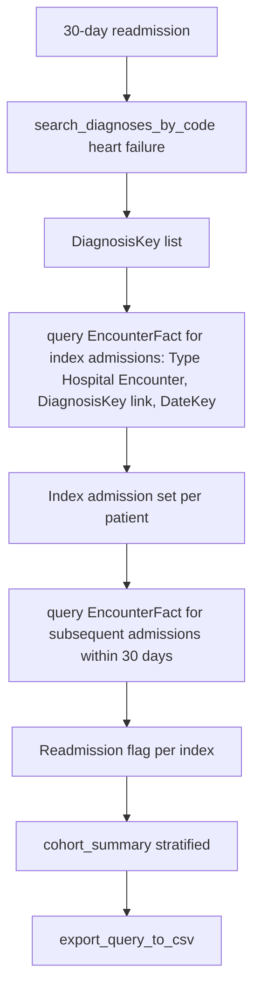

# Readmission Analysis

Research question: "What is the 30-day all-cause readmission rate among patients hospitalized for heart failure, and how does it stratify by sex and race?"

Readmission analysis identifies index admissions, then looks for any subsequent admission within thirty days for the same patient.

## Tool composition



## Canonical SQL pattern

```sql
-- Step 1: identify index hospitalizations for heart failure
WITH HFAdmits AS (
    SELECT DISTINCT e.PatientDurableKey, e.EncounterKey, e.DateKey AS IndexDateKey
    FROM deid_uf.EncounterFact e
    WHERE e.Type = 'Hospital Encounter'
      AND e.PatientDurableKey IN (
            SELECT DISTINCT PatientDurableKey
            FROM deid_uf.DiagnosisEventFact
            WHERE DiagnosisKey IN (/* HF keys */)
              AND StartDateKey > 19000101
      )
      AND e.DateKey BETWEEN 20230101 AND 20231231
)
SELECT * FROM HFAdmits;
-- Materialize HFAdmits, then for the readmission lookup use a hard-coded
-- IN(...) of (PatientDurableKey, IndexDateKey) pairs to avoid CTE+JOIN.

-- Step 2: subsequent admission within 30 days
SELECT e.PatientDurableKey, e.EncounterKey, e.DateKey AS ReadmitDateKey
FROM deid_uf.EncounterFact e
WHERE e.Type = 'Hospital Encounter'
  AND e.PatientDurableKey IN (/* HF cohort */)
  AND e.DateKey BETWEEN 20230102 AND 20240131;
-- Filter client-side to keep rows where ReadmitDateKey - IndexDateKey BETWEEN 1 AND 30.
```

## Trade-offs

| Dimension | Behavior |
|---|---|
| All-cause vs cause-specific | All-cause is straightforward; cause-specific readmission requires a diagnosis filter on the readmit encounter. |
| Index definition | First admission in window vs every admission; this changes the denominator. |
| Cross-system care | Readmissions to other hospitals are invisible to the EHR. |

## Common mistakes

- Using `StartDateKey` on `EncounterFact`; the date column for encounters is `DateKey`.
- Filtering by `Type = 'Inpatient'`. The observed value is `Hospital Encounter`; verify with `summarize_table('EncounterFact')` or `describe_table('EncounterFact')`.
- Allowing the readmission lookup to span the same encounter (zero-day difference). The 1-to-30-day window excludes the index encounter itself.
- Performing the readmission match with a self-join on `EncounterFact` joined to `PatientDim`; the subquery pattern keeps the join on `PatientDurableKey` only.
