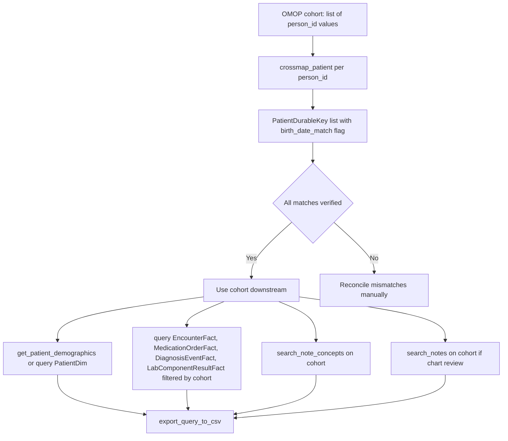

# OMOP-to-CDW Bridge

Research question: "I built a cohort in OMOP using standard concepts; now I need each patient's full clinical notes and lab strings from CDW."

The OMOP-to-CDW bridge resolves an OMOP `person_id` to a CDW `PatientDurableKey` using the `crossmap_patient` tool, then routes downstream queries through the CDW tools normally.

## Tool composition



## Canonical SQL pattern

`crossmap_patient(person_id=12345)` issues the following query (verbatim from `tools/queries.py`):

```sql
SELECT
    p.person_id, p.person_source_value, p.birth_datetime AS omop_birth_date,
    pd.PatientDurableKey, pd.PatientEpicId, pd.BirthDate AS cdw_birth_date,
    pd.Sex, pd.FirstRace, pd.Ethnicity, pd.PreferredLanguage, pd.Status
FROM OMOP_DEID.dbo.person p
JOIN CDW_NEW.deid_uf.PatientDim pd
  ON p.person_source_value = pd.PatientEpicId AND pd.IsCurrent = 1
WHERE p.person_id = 12345;
```

After the bridge resolves the cohort, downstream queries use the standard CDW pattern with `PatientDurableKey IN (...)`:

```sql
SELECT *
FROM deid_uf.LabComponentResultFact
WHERE PatientDurableKey IN ('PD0001', 'PD0002', 'PD0003')
  AND ResultDateKey > 19000101
ORDER BY PatientDurableKey, ResultDateKey;
```

## Trade-offs

| Dimension | Behavior |
|---|---|
| Coverage | Crossmap is one-to-one when `PatientEpicId` matches; mismatches are surfaced by the birth-date sanity check. |
| Latency | Cross-database join is fast for one identifier at a time. For large lists the agent calls the tool repeatedly or composes a custom `query` against both databases. |
| Trust | A `birth_date_match: False` annotation is a hard warning, not a soft signal. |

## Common mistakes

- Using `PatientKey` rather than `PatientDurableKey` after the bridge; the bridge returns `PatientDurableKey` precisely because all downstream CDW tools require it.
- Issuing a cross-schema query (`deid` ↔ `deid_uf`) instead of a cross-database query. The `deid_uf` schema is the only one that contains `PatientDurableKey`; the bridge stays within `deid_uf` on the CDW side.
- Treating `birth_date_match: False` as acceptable noise. The tool annotation `(VERIFY MANUALLY)` makes the expectation explicit.
