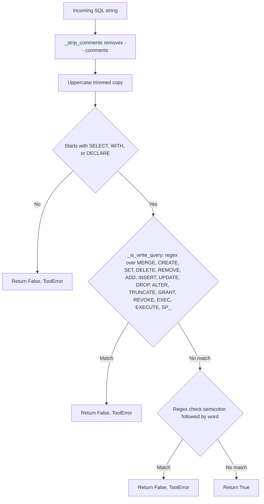
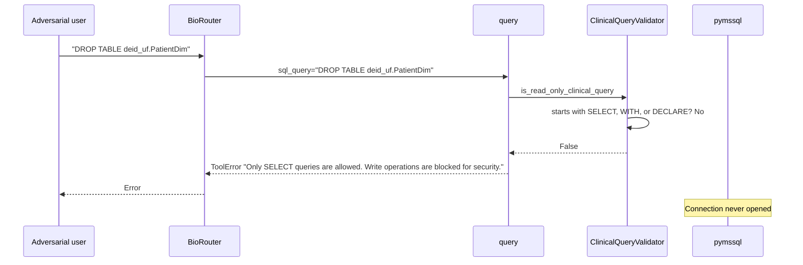

# Read-Only Enforcement and Write Rejection

Research question (from a security review perspective): "Can a misbehaving prompt cause the CDWAgent to mutate the warehouse?"

The CDWAgent enforces read-only access through `ClinicalQueryValidator.is_read_only_clinical_query` in `src/cdwagent/validation.py`. Every SQL-bearing tool (`query`, `export_query_to_csv`, `cohort_summary`, plus the helpers in `tools/queries.py`, `tools/notes.py`, and `tools/concepts.py`) routes its SQL through this validator before opening a database cursor.

## Validator logic

## Sequence diagram

## Allowed and blocked statements

| Input | Outcome |
|---|---|
| `SELECT 1` | Allowed |
| `WITH x AS (SELECT 1) SELECT * FROM x` | Allowed |
| `DECLARE @v INT = 1; SELECT @v` | Blocked: semicolon followed by token triggers the multi-statement rule |
| `INSERT INTO ...` | Blocked: does not start with allowed verb and matches `_is_write_query` |
| `SELECT 1; DROP TABLE T` | Blocked: semicolon-then-word regex |
| `MERGE INTO ...` | Blocked: write keyword regex |
| `EXEC sp_help` | Blocked: write keyword regex |
| `-- DROP TABLE T\nSELECT 1` | Allowed: comments are stripped before validation; the resulting SQL is a `SELECT` |

## Schema-discovery exemption

The three tools in `tools/schema.py` (`get_database_overview`, `describe_table`, `search_schema`) bypass the validator entirely because they do not touch the database; they read the bundled `schema_reference.json`. They cannot mutate state.

## Cohort and crossmap exemptions

`cohort_summary`'s `patient_key_query` is also passed through the validator because it is composed into a runtime SQL statement. `crossmap_patient` constructs its SQL with `int(person_id)` and a fixed template, then validates the result.

## Common mistakes

- Assuming the validator catches semantically dangerous SQL beyond the keyword and prefix rules. It does not. A malicious user with valid `SELECT` permissions could still exfiltrate large extracts; access controls on the database account are the primary defense.
- Adding a tool that bypasses the helper. The contributor guidance in `AGENTS.md` is to keep new SQL-bearing tools running through the same validator.
- Believing that line-comment stripping makes any input safe. The validator strips `--` comments before pattern matching, but parameterization is not implemented; user input is interpolated into SQL strings, so input cleansing remains a per-tool concern.
