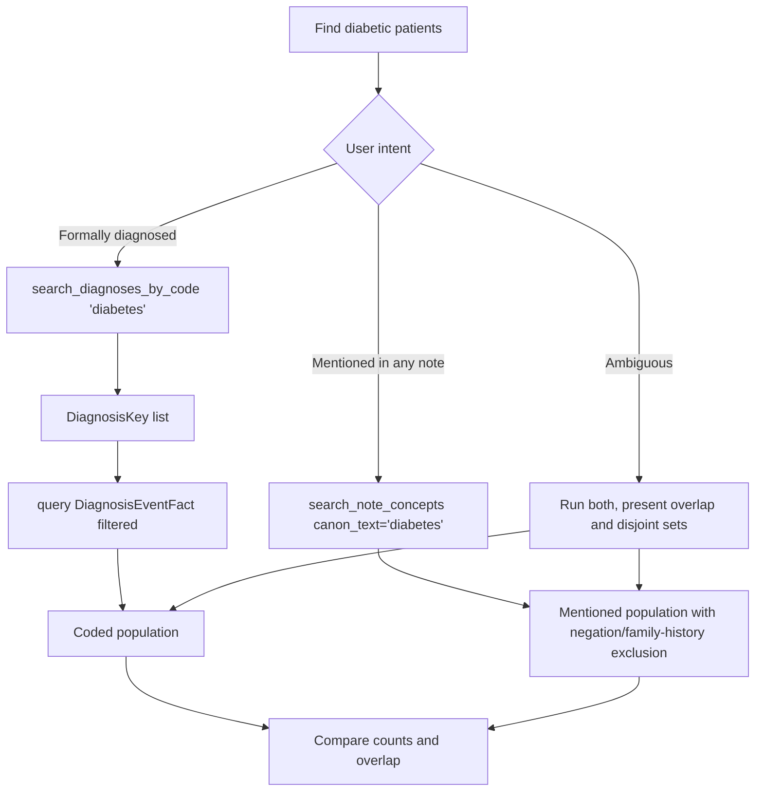

# Disambiguation: Structured-Coded vs Note-Mentioned

Research question: "Find diabetic patients."

Two valid interpretations exist. Either the user wants patients with a formal coded diagnosis (`DiagnosisEventFact` joined to `DiagnosisTerminologyDim`), or they want patients with any documented mention of diabetes (`note_concepts` via `search_note_concepts`). The two interpretations describe different populations with different sensitivity-specificity profiles. The decision tree in `CDW_SERVER_INSTRUCTIONS` requires the agent to surface the distinction when the question is ambiguous and either ask, or run both branches and present the difference.

## Tool composition



## Canonical SQL pattern

Coded branch:

```sql
SELECT DISTINCT PatientDurableKey
FROM deid_uf.DiagnosisEventFact
WHERE DiagnosisKey IN (
    SELECT DiagnosisKey
    FROM deid_uf.DiagnosisTerminologyDim
    WHERE Type = 'ICD-10-CM' AND Value LIKE 'E11%'
);
```

Mentioned branch (issued by `search_note_concepts(canon_text='diabetes')`):

```sql
SELECT TOP 100 nc.deid_note_key, nm.PatientDurableKey,
       nc.canon_text, nc.cui, nc.domain, nc.confidence,
       nc.negated, nc.family_history, nc.history,
       nm.note_type, nm.enc_dept_specialty, nm.deid_service_date,
       SUBSTRING(nt.note_text,
         CASE WHEN nc.offset_start - 100 < 1 THEN 1 ELSE nc.offset_start - 100 END,
         200) AS snippet
FROM deid_uf.note_concepts nc
JOIN deid_uf.note_metadata nm ON nc.deid_note_key = nm.deid_note_key
LEFT JOIN deid_uf.note_text nt ON nc.deid_note_key = nt.deid_note_key
WHERE 1=1
  AND nc.canon_text LIKE '%diabetes%'
  AND nc.negated = 0
  AND nc.family_history = 0
  AND nc.confidence >= 0.5
ORDER BY nm.deid_service_date DESC;
```

## Trade-offs

| Branch | Sensitivity | Specificity | Use when |
|---|---|---|---|
| Coded (`DiagnosisEventFact`) | Lower | Higher | Trial recruitment, billing-aligned analyses, regulatory studies |
| Mentioned (`note_concepts`) | Higher | Lower | Phenotype discovery, hypothesis generation, surveillance |
| Both | Maximal | Compute the symmetric difference to highlight under-coding or over-mentioning | Methods studies, data-quality assessments |

## Common mistakes

- Equating "diagnosed" with "coded" without confirming with the user.
- Disabling `exclude_negated` or `exclude_family_history` in the mentioned branch and then comparing populations; the comparison would reflect noise, not phenotype.
- Showing only one count when the question is ambiguous. The server instructions require the agent to surface the distinction.
- Using `LIKE '%diabetes%'` without a code-set filter; this can pick up secondary mentions (for example "diabetes mellitus type 2" alongside "diabetes insipidus") that are pathophysiologically unrelated.
