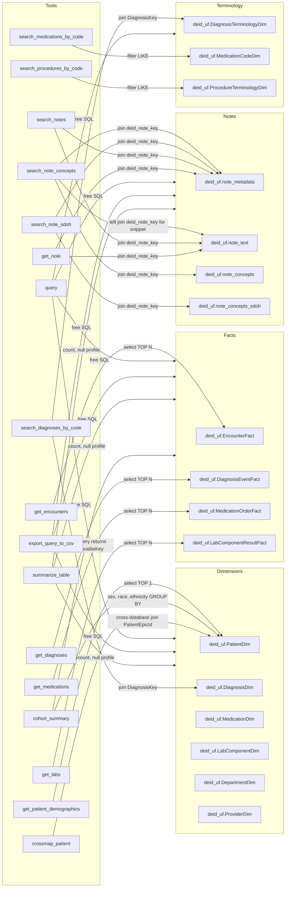

# Schema Interaction Map

The diagram below maps the fourteen most-used `deid_uf` tables to the tools that read each. Edges are labeled with the tool name (without the `CDW-` namespace prefix). Concept-search tools resolve names and codes to surrogate keys; cohort-defining queries then traverse fact tables via `PatientDurableKey IN (...)`. The schema-discovery tools (`get_database_overview`, `describe_table`, `search_schema`) read only `schema_reference.json` and therefore do not appear as edges in this map.

## Topology

## Glossary of tables

| Table | Role | Key columns |
|---|---|---|
| `deid_uf.PatientDim` | Patient demographics. SCD Type 2; filter `IsCurrent = 1`. | `PatientKey`, `PatientDurableKey`, `Sex`, `BirthDate`, `DeathDate`, `FirstRace`, `Ethnicity`, `PreferredLanguage`, `Status`, `IsCurrent`, `StartDate`, `PatientEpicId` |
| `deid_uf.EncounterFact` | Encounter events. | `EncounterKey`, `PatientDurableKey`, `PatientKey`, `DateKey`, `Type`, `DepartmentName`, `DepartmentSpecialty`, `PatientClass`, `VisitType` |
| `deid_uf.DiagnosisEventFact` | Diagnosis events. | `PatientDurableKey`, `DiagnosisKey`, `StartDateKey`, `EndDateKey` |
| `deid_uf.MedicationOrderFact` | Medication orders. | `PatientDurableKey`, `MedicationKey`, `OrderedDateKey`, `StartDateKey`, `EndDateKey` |
| `deid_uf.LabComponentResultFact` | Lab component results. | `PatientDurableKey`, `LabComponentKey`, `ResultDateKey`, `Value` (string), `ReferenceValues`, `Flag`, `Abnormal` |
| `deid_uf.note_metadata` | Note metadata; joined to `note_text` and `note_concepts*` via `deid_note_key`. | `deid_note_key`, `PatientDurableKey`, `note_type`, `encounter_type`, `enc_dept_specialty`, `deid_service_date` |
| `deid_uf.note_text` | Full note text. | `deid_note_key`, `note_text` |
| `deid_uf.note_concepts` | NLP-extracted concepts (cTAKES). | `deid_note_key`, `cui`, `canon_text`, `domain`, `confidence`, `negated`, `family_history`, `history`, `offset_start` |
| `deid_uf.note_concepts_sdoh` | NLP-extracted SDOH concepts (cTAKES SDOH module). | `deid_note_key`, `cui`, `canon_text`, `domain`, `confidence`, `negated` |
| `deid_uf.DiagnosisDim` | Diagnosis canonical names. | `DiagnosisKey`, `Name` |
| `deid_uf.DiagnosisTerminologyDim` | ICD/SNOMED codes. | `DiagnosisTerminologyKey`, `DiagnosisKey`, `Type`, `Value`, `DisplayString` |
| `deid_uf.MedicationDim` | Medication names. Pre-Epic legacy rows have `*Unspecified` for `GenericName`, `TherapeuticClass`, `Strength`, `Form`. | `MedicationKey`, `Name` |
| `deid_uf.MedicationCodeDim` | Medication codes (NDC, RxNorm). | `MedicationCodeKey`, `MedicationKey`, `Type`, `Code`, `MedicationName`, `MedicationGenericName`, `MedicationTherapeuticClass` |
| `deid_uf.LabComponentDim` | Lab dictionary. LOINC column is `LoincCode` (not `Loinc`). | `LabComponentKey`, `LoincCode`, `Name` |
| `deid_uf.DepartmentDim` | Department dimension. | `DepartmentKey`, `DepartmentName`, `DepartmentSpecialty` |
| `deid_uf.ProviderDim` | Provider dimension. | `ProviderKey`, `ProviderName` |

## Edge legend

- A solid arrow indicates a tool's SQL touches the table on the target side.
- The general-purpose `query` and `export_query_to_csv` tools are shown as touching all four table groups because their SQL is user-supplied.
- The schema-discovery tools (`get_database_overview`, `describe_table`, `search_schema`) read `schema_reference.json` from disk and do not touch the database; they are intentionally omitted from the map.
