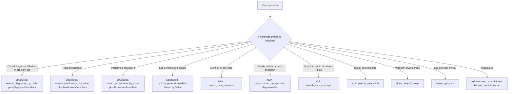

# Disambiguation Matrix

The CDWAgent must route phenotype questions to the appropriate retrieval surface. Two choices recur: structured fact-table queries (`DiagnosisEventFact`, `MedicationOrderFact`, `ProcedureEventFact`, `LabComponentResultFact`) and notes-derived NLP queries (`note_concepts`, `note_concepts_sdoh`, `note_text`). The two surfaces describe different populations and answer different research questions. The matrix below summarizes the trade-off and gives the agent a deterministic rule for surfacing the choice.

## Decision flow

## Sensitivity-specificity matrix

| Construct | Structured surface | Notes surface | Sensitivity | Specificity | When to prefer |
|---|---|---|---|---|---|
| Diabetes | `DiagnosisEventFact` joined to ICD-10 E11 codes | `search_note_concepts(canon_text='diabetes')` | Notes higher | Structured higher | Trial recruitment: structured. Phenotype discovery: notes. |
| Hypertension | `DiagnosisEventFact` joined to ICD-10 I10 codes | `search_note_concepts(canon_text='hypertension')` | Notes higher | Structured higher | Population health metrics use structured; symptom-driven hypotheses use notes. |
| On metformin | `MedicationOrderFact` joined to `MedicationCodeDim` | `search_note_concepts(canon_text='metformin')` | Comparable | Structured higher (orders are explicit) | Active treatment: structured. Past or off-label use: notes may help. |
| Chronic kidney disease stage | `LabComponentResultFact` (eGFR `Value`) | `search_note_concepts(canon_text='chronic kidney disease')` | Notes higher | Lab thresholds objective | Use lab values for staging; use notes for assessment narrative. |
| Family history of cancer | Not represented | `search_note_concepts(family_history flag)` | Only via notes | Variable; cTAKES family-history flag | Always notes. |
| Smoking status | `PatientDim.SmokingStatus` partial | `search_note_sdoh(canon_text='smoking')` | Notes higher | Comparable | Combine for ascertainment. |
| Housing instability | Rarely structured | `search_note_sdoh(canon_text='housing instability')` | Only via notes | cTAKES SDOH module | Always notes. |
| Foot exam performed | Sometimes via procedure or encounter | `search_note_concepts(canon_text='foot exam')` | Notes higher | Structured higher when present | Combine for care-gap detection. |
| Recent bowel surgery | `ProcedureEventFact` via CPT code | `search_note_concepts(canon_text='bowel surgery', exclude_historical=False)` | Comparable | Structured higher | Use structured when CPT exists; notes for outside-system surgery. |
| Verbatim phrase ("plan: increase metformin to 1000 mg BID") | Not represented | `search_notes(keyword='increase metformin')` | Only via verbatim | Free-text noise | Always `search_notes`. |

## Decision rule for the agent

When a question is ambiguous between coded and mentioned, the agent should follow this rule (encoded in `CDW_SERVER_INSTRUCTIONS` Step 3 of the notes decision tree):

1. State the two interpretations explicitly: "formally diagnosed" versus "mentioned in any note".
2. Either ask the user which interpretation is intended, or run both retrievals and present (a) the size of each population, (b) the size of the intersection, and (c) the size of each disjoint set (coded only, mentioned only).
3. When defaults matter (`exclude_negated=True`, `exclude_family_history=True`, `min_confidence=0.5`), state them in the answer so the user can choose to override.

## Worked example

For "find diabetic patients", a complete answer presents three counts:

| Set | SQL surface | Approximate semantics |
|---|---|---|
| Coded ∩ Mentioned | `DiagnosisEventFact` ∩ `note_concepts` mentions | Patients both formally diagnosed and discussed in notes |
| Coded only | `DiagnosisEventFact` minus `note_concepts` mentions | Possibly older problem-list entries with no recent narrative |
| Mentioned only | `note_concepts` minus `DiagnosisEventFact` | Possibly under-coded or differential-diagnosis mentions |

The relative sizes of these sets quantify under-coding and narrative-mention noise in the local data warehouse. The agent should compute and display this triplet whenever the user does not pre-commit to one interpretation.
